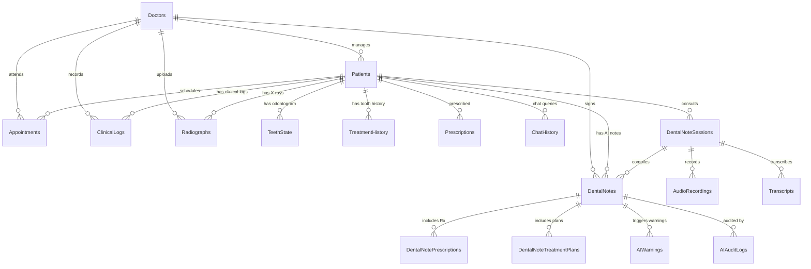

# 🦷 DENTIA Clinical Database Schema Documentation (`dentist.*`)

This document provides a comprehensive, verified reference for all **17 Tables** present in the SQL Server database under the `dentist` schema (`DentistAPI` on `DBSERVER3`).

---

## 📊 Complete Table Index (17 Tables)

| # | Schema & Table Name | Primary Key | Description | Module / Domain |
|---|---------------------|-------------|-------------|-----------------|
| 1 | `[dentist].[AIAuditLogs]` | `AuditId` (BigInt) | AI prompt execution & security hashes | AI Security & Compliance |
| 2 | `[dentist].[AIWarnings]` | `WarningId` (BigInt) | Clinical discrepancy & allergy warnings | AI Safety Checks |
| 3 | `[dentist].[Appointments]` | `AppointmentID` (Int) | Scheduled consultation slots & bookings | Appointment Management |
| 4 | `[dentist].[AudioRecordings]` | `AudioId` (BigInt) | Voice dictation audio files & checksums | Ambient Voice Scribe |
| 5 | `[dentist].[ChatHistory]` | `ChatID` (Int) | Patient-doctor clinical AI chat queries | AI Assistant Chatbot |
| 6 | `[dentist].[ClinicalLogs]` | `LogID` (Int) | Chronological patient clinical audit trail | Clinical Audit History |
| 7 | `[dentist].[DentalNotePrescriptions]` | `PrescriptionId` (BigInt) | Voice-dictated medications per clinical note | AI Note Prescriptions |
| 8 | `[dentist].[DentalNotes]` | `NoteId` (BigInt) | 8-section SOAP structured clinical notes | AI Clinical Notes |
| 9 | `[dentist].[DentalNoteSessions]` | `SessionId` (BigInt) | Consultation voice recording session lifecycle | Voice Session Lifecycle |
| 10 | `[dentist].[DentalNoteTreatmentPlans]` | `PlanId` (BigInt) | Multi-stage treatment plans & procedures | AI Treatment Planning |
| 11 | `[dentist].[Doctors]` | `DoctorID` (Int) | Dentist credentials, auth & region | User & Role Management |
| 12 | `[dentist].[Patients]` | `PatientID` (Int) | Patient demographics & active plan state | Patient Registry |
| 13 | `[dentist].[Prescriptions]` | `PrescriptionID` (Int) | Top-level patient medication chart | Pharmacy & Medications |
| 14 | `[dentist].[Radiographs]` | `RadiographID` (Int) | X-Rays, CBCT images & AI vision summaries | Imaging & Diagnostics |
| 15 | `[dentist].[TeethState]` | `TeethStateID` (Int) | 32-tooth odontogram conditions & colors | Odontogram Charting |
| 16 | `[dentist].[Transcripts]` | `TranscriptId` (BigInt) | Raw & cleaned speech-to-text transcriptions | Speech-to-Text Pipeline |
| 17 | `[dentist].[TreatmentHistory]` | `HistoryID` (Int) | Per-tooth chronological treatment records | Treatment History |

---

## 🗄️ Detailed Data Dictionary & Schema Definitions

---

### 1. `[dentist].[AIAuditLogs]`
*Stores model inference metadata, input/output SHA256 integrity hashes, and prompt versions for audit compliance.*

| Column Name | Data Type | Max Length | Nullable | Default | Description |
|-------------|-----------|------------|----------|---------|-------------|
| `AuditId` | `BIGINT` (IDENTITY) | - | NO (PK) | - | Unique Audit Log Identifier |
| `NoteId` | `BIGINT` | - | YES (FK) | - | Associated `DentalNotes.NoteId` |
| `UserId` | `INT` | - | YES (FK) | - | Doctor/Staff user identifier |
| `Action` | `VARCHAR` | 50 | YES | - | Action name (e.g. `COMPILATION`, `EDIT`, `APPROVE`) |
| `ModelName` | `VARCHAR` | 200 | YES | - | Gemini Model version (e.g. `gemini-3.5-flash`) |
| `PromptVersion` | `VARCHAR` | 50 | YES | - | Scribe prompt system instruction version |
| `InputHash` | `VARCHAR` | 64 | YES | - | SHA256 hash of prompt input |
| `OutputHash` | `VARCHAR` | 64 | YES | - | SHA256 hash of model response |
| `CreatedAt` | `DATETIME2` | - | YES | `SYSUTCDATETIME()` | Audit timestamp |

---

### 2. `[dentist].[AIWarnings]`
*Stores clinical contraindication warnings, dosage alerts, and missing field alerts generated by AI.*

| Column Name | Data Type | Max Length | Nullable | Default | Description |
|-------------|-----------|------------|----------|---------|-------------|
| `WarningId` | `BIGINT` (IDENTITY) | - | NO (PK) | - | Unique Warning Identifier |
| `NoteId` | `BIGINT` | - | YES (FK) | - | Target `DentalNotes.NoteId` |
| `FieldName` | `NVARCHAR` | 100 | YES | - | Section affected (e.g. `Prescriptions`, `Allergies`) |
| `Message` | `NVARCHAR` | 1000 | YES | - | Warning text alert for dentist |
| `Severity` | `VARCHAR` | 20 | YES | - | `warning`, `critical`, `info` |
| `Resolved` | `BIT` | - | YES | `0` | Flag if doctor reviewed & dismissed |

---

### 3. `[dentist].[Appointments]`
*Patient clinic scheduling, appointments, voice-booked follow-ups, and statuses.*

| Column Name | Data Type | Max Length | Nullable | Default | Description |
|-------------|-----------|------------|----------|---------|-------------|
| `AppointmentID` | `INT` (IDENTITY) | - | NO (PK) | - | Unique Appointment Identifier |
| `FullName` | `NVARCHAR` | 100 | NO | - | Patient full name |
| `Phone` | `NVARCHAR` | 50 | YES | - | Contact phone number |
| `Email` | `NVARCHAR` | 100 | YES | - | Email address |
| `PreferredDate` | `DATETIME` | - | NO | - | Scheduled appointment datetime |
| `CreatedAt` | `DATETIME` | - | YES | `GETDATE()` | Booking creation timestamp |
| `Status` | `NVARCHAR` | 50 | YES | `'Pending'` | `Pending`, `Confirmed`, `Completed`, `Cancelled` |
| `Reason` | `NVARCHAR` | MAX | YES | - | Purpose of visit / treatment procedure |
| `DoctorID` | `INT` | - | YES (FK) | - | Assigned `Doctors.DoctorID` |

---

### 4. `[dentist].[AudioRecordings]`
*Acoustic audio file metadata, storage references, duration, and SHA256 anti-duplicate hashes.*

| Column Name | Data Type | Max Length | Nullable | Default | Description |
|-------------|-----------|------------|----------|---------|-------------|
| `AudioId` | `BIGINT` (IDENTITY) | - | NO (PK) | - | Unique Audio Identifier |
| `SessionId` | `BIGINT` | - | YES (FK) | - | Parent `DentalNoteSessions.SessionId` |
| `StorageUri` | `NVARCHAR` | 1000 | YES | - | File storage path / cloud URI |
| `MimeType` | `VARCHAR` | 100 | YES | - | Audio format (e.g. `audio/webm`, `audio/wav`) |
| `DurationSeconds` | `INT` | - | YES | - | Recording duration in seconds |
| `Sha256Hash` | `VARCHAR` | 64 | YES | - | Unique hash for race condition deduplication |
| `CreatedAt` | `DATETIME2` | - | YES | `SYSUTCDATETIME()` | Recording upload timestamp |

---

### 5. `[dentist].[ChatHistory]`
*Stores natural language inquiries, clinical chatbot dialogues, and AI assistant actions.*

| Column Name | Data Type | Max Length | Nullable | Default | Description |
|-------------|-----------|------------|----------|---------|-------------|
| `ChatID` | `INT` (IDENTITY) | - | NO (PK) | - | Unique Chat Entry Identifier |
| `PatientID` | `INT` | - | YES (FK) | - | Patient context `Patients.PatientID` |
| `Transcript` | `NVARCHAR` | MAX | NO | - | Doctor voice / text query |
| `ParsedAction` | `NVARCHAR` | MAX | NO | - | AI Assistant response / executed command |
| `Timestamp` | `DATETIME` | - | YES | `GETDATE()` | Interaction timestamp |

---

### 6. `[dentist].[ClinicalLogs]`
*Chronological clinical audit trail documenting treatments, notes, prescriptions, and administrative actions.*

| Column Name | Data Type | Max Length | Nullable | Default | Description |
|-------------|-----------|------------|----------|---------|-------------|
| `LogID` | `INT` (IDENTITY) | - | NO (PK) | - | Unique Log Identifier |
| `PatientID` | `INT` | - | YES (FK) | - | Target `Patients.PatientID` |
| `DoctorID` | `INT` | - | YES (FK) | - | Attending `Doctors.DoctorID` |
| `Message` | `NVARCHAR` | MAX | NO | - | Detailed description of clinical activity |
| `LogType` | `NVARCHAR` | 50 | YES | `'info'` | `Treatment`, `Prescription`, `Voice Scribe`, `Appointment`, `Administrative`, `Orthodontics`, `Whitening`, `Restorative` |
| `CreatedAt` | `DATETIME` | - | YES | `GETDATE()` | Event timestamp |

---

### 7. `[dentist].[DentalNotePrescriptions]`
*Structured medications parsed by AI from clinical voice dictations linked directly to AI Notes.*

| Column Name | Data Type | Max Length | Nullable | Default | Description |
|-------------|-----------|------------|----------|---------|-------------|
| `PrescriptionId` | `BIGINT` (IDENTITY) | - | NO (PK) | - | Unique Prescription Identifier |
| `NoteId` | `BIGINT` | - | YES (FK) | - | Parent `DentalNotes.NoteId` |
| `MedicationName` | `NVARCHAR` | 300 | YES | - | Drug generic / brand name (e.g. `Amoxicillin`, `Ibuprofen`) |
| `Strength` | `NVARCHAR` | 100 | YES | - | Strength (e.g. `500 mg`, `600 mg`) |
| `Dose` | `NVARCHAR` | 100 | YES | - | Dosage (e.g. `1 tablet`, `5 ml`) |
| `Route` | `NVARCHAR` | 100 | YES | - | Administration route (`Oral`, `Topical`) |
| `Frequency` | `NVARCHAR` | 100 | YES | - | Frequency (e.g. `TDS`, `Twice daily`, `As needed for pain`) |
| `Duration` | `NVARCHAR` | 100 | YES | - | Course length (e.g. `5 days`, `1 week`) |
| `Instructions` | `NVARCHAR` | MAX | YES | - | Special clinical instructions (e.g. `Take after meals`) |
| `Confidence` | `DECIMAL(5,2)` | - | YES | - | Extraction confidence score |

---

### 8. `[dentist].[DentalNotes]`
*Comprehensive 8-Section AI Clinical Notes generated from ambient speech consultations.*

| Column Name | Data Type | Max Length | Nullable | Default | Description |
|-------------|-----------|------------|----------|---------|-------------|
| `NoteId` | `BIGINT` (IDENTITY) | - | NO (PK) | - | Unique Clinical Note Identifier |
| `SessionId` | `BIGINT` | - | YES (FK) | - | Parent `DentalNoteSessions.SessionId` |
| `PatientId` | `INT` | - | YES (FK) | - | Target `Patients.PatientID` |
| `DentistId` | `INT` | - | YES (FK) | - | Attending `Doctors.DoctorID` |
| `Summary` | `NVARCHAR` | MAX | YES | - | 1. Executive Consultation Summary |
| `ChiefComplaint`| `NVARCHAR` | MAX | YES | - | 2. Chief Complaint & Symptoms |
| `History` | `NVARCHAR` | MAX | YES | - | 3. Medical & Dental History |
| `Examination` | `NVARCHAR` | MAX | YES | - | 4. Objective Clinical & Odontogram Exam |
| `Assessment` | `NVARCHAR` | MAX | YES | - | 5. Diagnosis & Clinical Assessment |
| `TreatmentPerformed` | `NVARCHAR` | MAX | YES | - | 6. Procedures & Interventions Executed Today |
| `PostOpAdvice` | `NVARCHAR` | MAX | YES | - | 7. Post-Operative Advice & Patient Guidance |
| `FollowUp` | `NVARCHAR` | MAX | YES | - | 8. Follow-Up & Recall Schedule |
| `Status` | `VARCHAR` | 30 | YES | - | `Draft`, `Approved`, `Signed` |
| `ApprovedAt` | `DATETIME2` | - | YES | - | Timestamp of doctor sign-off |
| `ApprovedBy` | `INT` | - | YES (FK) | - | Signing `Doctors.DoctorID` |
| `CreatedAt` | `DATETIME2` | - | YES | `SYSUTCDATETIME()` | Generation timestamp |
| `UpdatedAt` | `DATETIME2` | - | YES | `SYSUTCDATETIME()` | Last edit timestamp |
| `AudioId` | `BIGINT` | - | YES (FK) | - | Source `AudioRecordings.AudioId` |
| `IsDeleted` | `BIT` | - | YES | `0` | Soft delete flag (`1` = Deleted, `0` = Active) |

---

### 9. `[dentist].[DentalNoteSessions]`
*Tracks the recording session state machine between frontend audio capture and backend AI compilation.*

| Column Name | Data Type | Max Length | Nullable | Default | Description |
|-------------|-----------|------------|----------|---------|-------------|
| `SessionId` | `BIGINT` (IDENTITY) | - | NO (PK) | - | Unique Session Identifier |
| `PatientId` | `INT` | - | YES (FK) | - | Target `Patients.PatientID` |
| `DentistId` | `INT` | - | YES (FK) | - | Attending `Doctors.DoctorID` |
| `Status` | `VARCHAR` | 30 | YES | - | `RECORDING`, `PROCESSING`, `COMPLETED`, `FAILED` |
| `StartedAt` | `DATETIME2` | - | YES | - | Recording start timestamp |
| `CompletedAt`| `DATETIME2` | - | YES | - | Recording stop timestamp |
| `CreatedAt` | `DATETIME2` | - | YES | `SYSUTCDATETIME()` | Session record creation |

---

### 10. `[dentist].[DentalNoteTreatmentPlans]`
*Multi-stage planned future dental procedures parsed from doctor voice instructions.*

| Column Name | Data Type | Max Length | Nullable | Default | Description |
|-------------|-----------|------------|----------|---------|-------------|
| `PlanId` | `BIGINT` (IDENTITY) | - | NO (PK) | - | Unique Plan Stage Identifier |
| `NoteId` | `BIGINT` | - | YES (FK) | - | Associated `DentalNotes.NoteId` |
| `SequenceNo` | `INT` | - | YES | - | Stage number (e.g. `1`, `2`, `3`) |
| `ProcedureName` | `NVARCHAR` | 300 | YES | - | Planned procedure (e.g. `RCT Obturation`, `Crown`) |
| `ToothOrSite` | `NVARCHAR` | 100 | YES | - | Tooth number or anatomical site |
| `Timing` | `NVARCHAR` | 200 | YES | - | Scheduled interval (e.g. `In 2 weeks`, `Next visit`) |
| `Notes` | `NVARCHAR` | MAX | YES | - | Specific clinical notes & materials |

---

### 11. `[dentist].[Doctors]`
*Dentists, specialists, and administrator accounts.*

| Column Name | Data Type | Max Length | Nullable | Default | Description |
|-------------|-----------|------------|----------|---------|-------------|
| `DoctorID` | `INT` (IDENTITY) | - | NO (PK) | - | Unique Doctor Identifier |
| `Username` | `NVARCHAR` | 50 | NO | - | Login username |
| `PasswordHash`| `NVARCHAR` | 255 | NO | - | BCrypt / SHA256 hashed password |
| `FirstName` | `NVARCHAR` | 50 | NO | - | First name |
| `LastName` | `NVARCHAR` | 50 | NO | - | Last name |
| `CreatedAt` | `DATETIME` | - | YES | `GETDATE()` | Registration date |
| `Region` | `NVARCHAR` | 10 | YES | `'NZ'` | Regional locale (`PK`, `NZ`, `US`, etc.) |
| `IsSuperAdmin`| `BIT` | - | YES | `0` | Super admin privileges |

---

### 12. `[dentist].[Patients]`
*Patient master demographics, contact information, region, and active orthodontic/cosmetic treatment modality.*

| Column Name | Data Type | Max Length | Nullable | Default | Description |
|-------------|-----------|------------|----------|---------|-------------|
| `PatientID` | `INT` (IDENTITY) | - | NO (PK) | - | Unique Patient Identifier |
| `FirstName` | `NVARCHAR` | 50 | NO | - | Patient first name |
| `LastName` | `NVARCHAR` | 50 | NO | - | Patient last name |
| `DOB` | `DATE` | - | YES | - | Date of Birth |
| `Phone` | `NVARCHAR` | 20 | YES | - | Primary phone number |
| `CreatedAt` | `DATETIME` | - | YES | `GETDATE()` | Profile registration date |
| `DoctorID` | `INT` | - | YES (FK) | - | Primary attending dentist |
| `NHINumber` | `NVARCHAR` | 50 | YES | - | National Health Index / ID Number |
| `Address` | `NVARCHAR` | 255 | YES | - | Residential address |
| `Email` | `NVARCHAR` | 255 | YES | - | Contact email |
| `Gender` | `NVARCHAR` | 50 | YES | - | `Male`, `Female`, `Other` |
| `Region` | `NVARCHAR` | 10 | YES | `'NZ'` | Practice region (`PK`, `NZ`, etc.) |
| `CurrentTreatmentPlan` | `NVARCHAR` | 100 | YES | `'General Consultation'` | Active modality: `Braces (Orthodontics)`, `Teeth Whitening (Cosmetic)`, `Cavity Restorative` |
| `TreatmentStage` | `NVARCHAR` | 100 | YES | - | Active stage (e.g. `Stage 2 - Space Closure`, `Session 1 of 3`) |
| `TargetShade` | `NVARCHAR` | 50 | YES | - | Target shade or wire specification |
| `ProfileImage` | `VARBINARY(MAX)` | - | YES | `NULL` | Raw binary image bytes (up to 5MB max, optional) |
| `ProfileImageMimeType` | `VARCHAR` | 50 | YES | `NULL` | Image MIME format (e.g. `image/jpeg`, `image/png`, `image/webp`) |

---

### 13. `[dentist].[Prescriptions]`
*Top-level active medication history shown on patient charts.*

| Column Name | Data Type | Max Length | Nullable | Default | Description |
|-------------|-----------|------------|----------|---------|-------------|
| `PrescriptionID` | `INT` (IDENTITY) | - | NO (PK) | - | Unique Prescription Identifier |
| `PatientID` | `INT` | - | YES (FK) | - | Associated `Patients.PatientID` |
| `MedicineName` | `NVARCHAR` | 255 | NO | - | Prescribed medication summary |
| `PrescribedDate` | `DATETIME` | - | YES | `GETDATE()` | Date prescribed |

---

### 14. `[dentist].[Radiographs]`
*Digital imaging, Bitewing, Periapical, Panoramic X-rays, and AI vision findings.*

| Column Name | Data Type | Max Length | Nullable | Default | Description |
|-------------|-----------|------------|----------|---------|-------------|
| `RadiographID` | `INT` (IDENTITY) | - | NO (PK) | - | Unique Radiograph Identifier |
| `PatientID` | `INT` | - | YES (FK) | - | Associated `Patients.PatientID` |
| `DoctorID` | `INT` | - | YES (FK) | - | Uploading `Doctors.DoctorID` |
| `ImageName` | `NVARCHAR` | 255 | NO | - | Original filename |
| `MimeType` | `NVARCHAR` | 100 | NO | - | Image format (e.g. `image/png`, `image/jpeg`) |
| `ImageData` | `VARBINARY` | MAX | NO | - | Binary image payload |
| `UploadedAt` | `DATETIME` | - | YES | `GETDATE()` | Upload timestamp |
| `AnalysisSummary` | `NVARCHAR` | MAX | YES | - | AI vision diagnostic interpretation |

---

### 15. `[dentist].[TeethState]`
*Interactive 32-tooth odontogram state management tracking conditions, procedures, and colors.*

| Column Name | Data Type | Max Length | Nullable | Default | Description |
|-------------|-----------|------------|----------|---------|-------------|
| `TeethStateID` | `INT` (IDENTITY) | - | NO (PK) | - | Unique Record Identifier |
| `PatientID` | `INT` | - | YES (FK) | - | Target `Patients.PatientID` |
| `ToothNumber` | `INT` | - | NO | - | Universal Tooth Number (`1` to `32`) |
| `ConditionColor` | `NVARCHAR` | 10 | YES | `'#008000'` | Hex color code (`#10B981`, `#EF4444`, `#F59E0B`, etc.) |
| `ConditionStatus`| `NVARCHAR` | 50 | YES | `'Healthy'` | `Healthy`, `Damaged / Decay`, `Root Canal Needed`, `Cleaning Needed`, `Already Treated`, `Missing` |
| `LastUpdated` | `DATETIME` | - | YES | `GETDATE()` | Last updated timestamp |

---

### 16. `[dentist].[Transcripts]`
*Raw speech-to-text input and normalized multilingual clinical transcriptions.*

| Column Name | Data Type | Max Length | Nullable | Default | Description |
|-------------|-----------|------------|----------|---------|-------------|
| `TranscriptId` | `BIGINT` (IDENTITY) | - | NO (PK) | - | Unique Transcript Identifier |
| `SessionId` | `BIGINT` | - | YES (FK) | - | Associated `DentalNoteSessions.SessionId` |
| `RawText` | `NVARCHAR` | MAX | YES | - | Raw speech-to-text stream |
| `CleanedText` | `NVARCHAR` | MAX | YES | - | Deduplicated & cleaned clinical transcript |
| `Language` | `VARCHAR` | 20 | YES | - | Spoken language/locale (e.g. `en-US`, `ur-PK`) |
| `CreatedAt` | `DATETIME2` | - | YES | `SYSUTCDATETIME()` | Transcript generation timestamp |

---

### 17. `[dentist].[TreatmentHistory]`
*Per-tooth historical logs of past completed treatments, restorations, and interventions.*

| Column Name | Data Type | Max Length | Nullable | Default | Description |
|-------------|-----------|------------|----------|---------|-------------|
| `HistoryID` | `INT` (IDENTITY) | - | NO (PK) | - | Unique History Identifier |
| `PatientID` | `INT` | - | YES (FK) | - | Target `Patients.PatientID` |
| `ToothNumber` | `INT` | - | NO | - | Tooth number (`1` to `32`) |
| `TreatmentPerformed` | `NVARCHAR` | 100 | YES | - | Procedure name (e.g. `Pulpectomy`, `Composite Restoration`) |
| `Comments` | `NVARCHAR` | MAX | YES | - | Clinical notes, materials, or medicaments used |
| `ActionDate` | `DATETIME` | - | YES | `GETDATE()` | Execution timestamp |

---

## 🔗 Entity Relationship & Data Flow Architecture

---

## 🛡️ Database Verification Summary
- **Total Tables**: 17 / 17 Verified
- **Schema Name**: `dentist`
- **Database Engine**: Microsoft SQL Server
- **Authentication**: SQL Server Authentication / Multi-Tenant Support
- **Soft Deletion**: Supported on `DentalNotes` via `IsDeleted BIT DEFAULT 0`
