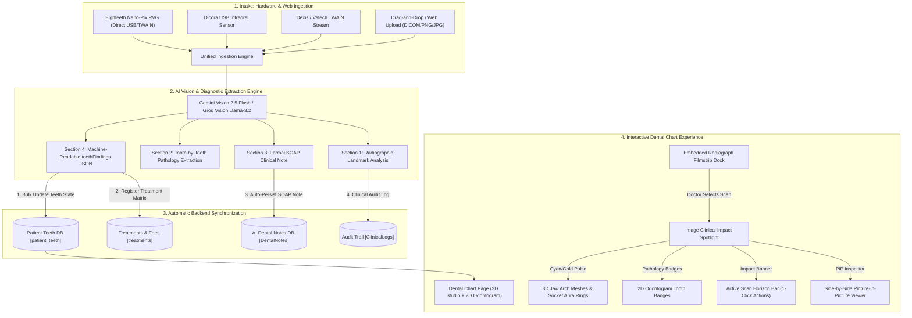

# Dentia Diagnostic Imaging & Dental Chart Unified Workflow Specification
## Clinical AI Vision, Direct Chart Radiograph Dock, Bi-Directional Impact Highlighting & Automated AI-Notes Synchronization

**Version:** 2.4.0  
**Status:** Production Design Specification & Architecture  
**Target Systems:** Dentia Web Workspace (`Dentistfrontend`), .NET Core API (`DentistAPI`), Gemini Vision 2.5 / Groq Vision Engine  
**Hardware Profiles:** Eighteeth Nano-Pix RVG, Dicora USB Intraoral Sensor, Dexis Platinum, HD Intraoral Cameras, Direct File Upload (DICOM / JPEG / PNG)

---

## 1. Executive Summary & Clinical Problem Statement

In contemporary digital dentistry, clinicians rely on radiographic diagnostics (intraoral periapical RVG, bitewings, panoramic OPG) as the cornerstone of diagnosis and treatment planning. However, existing dental software suffers from severe **context fragmentation**:

```
[ Traditional Fragmented Workflow (Broken) ]
1. Hardware / Sensor Capture ➔ Saved in separate vendor software (Dicora / Nano-Pix)
2. Manual Export ➔ Re-uploaded to Clinic Imaging Tab
3. Isolated AI Report ➔ Stored as disconnected text inside imaging module
4. Context Switching ➔ Doctor must leave Imaging tab, switch to Dental Chart tab
5. Manual Charting ➔ Doctor re-keys condition, tooth numbers, and CDT codes on Odontogram
6. Manual SOAP Note ➔ Doctor switches to AI-Notes tab and manually re-writes the diagnosis
```

### The Dentia Unified Solution
This specification establishes a **zero-friction, real-time diagnostic bridge** across three critical pillars:
1. **Imaging & X-Rays Intake (Hardware & Frontend)**: Direct capture from USB sensors (Eighteeth Nano-Pix, Dicora) and web upload.
2. **Embedded Dental Chart Filmstrip & Clinical Impact Dock**: Clinicians view, inspect, and toggle patient radiographs **directly on the Dental Chart** (without leaving the 3D Jaw and Odontogram).
3. **Bi-Directional Image-to-Chart Impact Highlighting**: When the clinician clicks any radiograph (e.g. Scan #111 `1.jpg` or Scan #112 `3.jpg`), the Dental Chart immediately spotlights **the exact teeth diagnosed by that image** with illuminated glowing 3D sockets, 2D odontogram pathology badges, and an actionable Impact Horizon Banner.
4. **Automated AI-Notes Synchronization**: Every radiograph analysis automatically compiles and persists an official **SOAP Clinical Note** directly into the patient's "AI Notes" repository and clinical ledger.

---

## 2. End-to-End System Architecture



---

## 3. Hardware & Ingestion Matrix (Nano-Pix, Dicora, Web)

Clinicians obtain radiographs through two primary channels. Both feed into the identical high-fidelity pipeline:

| Intake Channel | Device / Source | Protocol / Mechanism | Latency | Auto-Trigger Behavior |
| :--- | :--- | :--- | :--- | :--- |
| **Direct USB RVG Sensor** | **Eighteeth Nano-Pix 1 & 2** | WebHID / Direct USB Video Stream / TWAIN Bridge | Instant (1.2s) | Sensor triggers auto-exposure capture on X-ray pulse; stream freezes frame and automatically submits to AI Vision pipeline. |
| **Intraoral Sensor** | **Dicora USB Dental RVG** | Direct WDM / DirectShow / File Watcher | Instant (1.5s) | Hardware detects scintillator exposure; captures 16-bit uncompressed frame; transmits to Dentia Ingestion Endpoint. |
| **Proprietary Bridges** | **Dexis / Vatech / Carestream** | Local WebSocket Bridge agent (`localhost:18990`) | < 2.0s | Watches export directory (`C:\DentiaBridge\HotFolder\`) and streams acquired DICOM/TIFF to Dentia API. |
| **Frontend Web Upload** | **Browser Drag & Drop** | HTML5 Drag-and-Drop / File Input (`multipart/form-data`) | Instant | Accepts DICOM (.dcm), JPG, PNG, TIFF. Generates client-side thumbnail preview while asynchronously analyzing with Gemini. |

---

## 4. Radiograph Diagnostic Analysis & Tooth-Level Extraction

When an image is received, Gemini Vision executes multi-tier dental radiology reasoning and outputs a standardized 4-part clinical document:

### 4.1 Diagnostic Output Schema
1. **Section 1: Radiographic Overview**: Modality (Bitewing, Periapical, Panoramic), bone crest levels, crown-to-root ratio, lamina dura integrity, periodontal ligament space widening.
2. **Section 2: Tooth-by-Tooth Pathology Findings**: Detailed narrative listing of each diagnosed tooth, classifying pathologies into:
   - **Dental Caries:** Interproximal (MO/DO/MOD), Occlusal, Recurrent/Secondary caries under restorations.
   - **Periapical Radiolucency:** Apical periodontitis, apical granuloma, radicular cyst, necrotic pulp involvement.
   - **Periodontal Bone Loss:** Horizontal/vertical bone defect, furcation involvement (Grade I–III).
   - **Prosthetic & Restorative Status:** Overhanging margins, open margins, fractured restoration, root canal obturation quality.
   - **Impactions & Structural Anomalies:** Mesioangular, horizontal, or distoangular impaction.
3. **Section 3: Formal SOAP Clinical Diagnostic Note**:
   - `Subjective`: Diagnostic indication, patient symptoms, reason for radiograph.
   - `Objective`: Radiographic findings, bone architecture, trabecular pattern, tooth-by-tooth status.
   - `Assessment`: Definitive clinical diagnoses (ICD-10-CM dental equivalents).
   - `Plan`: Recommended treatment plan with official ADA CDT procedure codes (e.g. `D2392`, `D3330`, `D4341`, `D6750`).
4. **Section 4: Embedded Machine-Readable JSON Block (`teethFindings`)**:
```json
{
  "radiographId": 111,
  "imageName": "1.jpg",
  "modality": "Periapical RVG",
  "device": "Eighteeth Nano-Pix",
  "teethFindings": [
    {
      "toothNumber": 14,
      "toothKey": "14",
      "condition": "Defective Restoration / Recurrent Caries",
      "severity": "Moderate",
      "confidence": 92,
      "color": "#F59E0B",
      "cdtCode": "D2392",
      "procedure": "Resin-Based Composite - Two Surfaces, Posterior",
      "surface": "MO",
      "status": "Planned"
    },
    {
      "toothNumber": 19,
      "toothKey": "19",
      "condition": "Periapical Radiolucency / Apical Periodontitis",
      "severity": "Severe",
      "confidence": 95,
      "color": "#DC2626",
      "cdtCode": "D3330",
      "procedure": "Endodontic Therapy, Molar",
      "surface": "Apical",
      "status": "Planned"
    },
    {
      "toothNumber": 30,
      "toothKey": "30",
      "condition": "Defective Bridge Margin / Secondary Caries",
      "severity": "Moderate",
      "confidence": 89,
      "color": "#F59E0B",
      "cdtCode": "D6750",
      "procedure": "Crown - Porcelain Fused to High Noble Metal",
      "surface": "Marginal",
      "status": "Planned"
    }
  ],
  "soap": {
    "subjective": "Diagnostic RVG acquired for quadrant assessment and pain localization.",
    "objective": "Periapical radiolucency observed at mesial root apex of #19. Recurrent caries with defective margin noted at #14. Defective bridge margin with secondary decay observed at #30.",
    "assessment": "Tooth #19: Symptomatic apical periodontitis. Tooth #14: Secondary recurrent dental caries. Tooth #30: Failed prosthetic abutment margin.",
    "plan": "Tooth #19: Root canal therapy (CDT D3330). Tooth #14: Composite restoration (CDT D2392). Tooth #30: Abutment crown re-preparation and replacement (CDT D6750)."
  }
}
```

---

## 5. UI/UX Solution: The Dental Chart Radiographic Experience

### 5.1 Embedded Radiograph Filmstrip Dock (`ChartRadiographFilmstrip.jsx`)
Instead of forcing the clinician to toggle between the **Dental Chart** tab and the **Imaging & X-Rays** tab, a sleek, collapsable dock is embedded directly at the base of the Dental Chart workstation, positioned between the 3D Jaw Arch and the 2D Odontogram:

```
+---------------------------------------------------------------------------------------------------+
|  [3D INTERACTIVE JAW STUDIO] Maxilla & Mandible Three.js Canvas                                    |
|                                                                                                   |
|  [Active Scan Horizon: Scan #111 (1.jpg) - Nano-Pix]                                              |
|  * 3 Teeth Impacted: #14 (Defective MO), #19 (Apical Radiolucency), #30 (Defective Bridge)        |
|  [ Inspect X-Ray (PiP) ]   [ Re-Apply Impact to Chart ]   [ Open AI SOAP Note ]   [ Clear Filter ]|
+---------------------------------------------------------------------------------------------------+
|  === DIAGNOSTIC RADIOGRAPHS FILMSTRIP DOCK (5 Scans) =================================  [Collapse] |
|                                                                                                   |
|  [+ Capture Sensor (Nano-Pix/Dicora)]  [+ Upload File]                                            |
|                                                                                                   |
|  +--------------+  +--------------+  +--------------+  +--------------+  +--------------+         |
|  | [Thumbnail]  |  | [Thumbnail]  |  | [Thumbnail]  |  | [Thumbnail]  |  | [Thumbnail]  |  [ > ]  |
|  | Scan #111    |  | Scan #112    |  | Scan #109    |  | Scan #105    |  | Scan #104    | (Scroll)|
|  | Periapical   |  | Panoramic    |  | Bitewing     |  | Periapical   |  | Intraoral    |         |
|  | * #14,#19,#30|  | * 25 Teeth   |  | * #2, #3     |  | Healthy      |  | * #8         |         |
|  | [SELECTED]   |  |              |  |              |  |              |  |              |         |
|  +--------------+  +--------------+  +--------------+  +--------------+  +--------------+         |
+---------------------------------------------------------------------------------------------------+
|  [2D ODONTOGRAM ROW] Maxillary Arch (1-16) & Mandibular Arch (17-32)                             |
|  * #14 Glowing (Yellow/Amber)   * #19 Pulsing (Bright Red)   * #30 Glowing (Yellow/Amber)         |
+---------------------------------------------------------------------------------------------------+
```

#### Dock UI Features:
1. **Device Badges**: Every card shows the capture hardware: `Eighteeth Nano-Pix`, `Dicora USB`, `Dexis RVG`, or `Web Upload`.
2. **Modality Badges**: Color-coded badges for `Panoramic (OPG)`, `Periapical (RVG)`, `Bitewing (BWX)`.
3. **Impacted Teeth Chips**: Clickable colored chips showing the exact teeth identified (e.g. `⚡ #14, #19, #30`).
4. **Active Selection State**: High-contrast illuminated border with a cyan glow (`box-shadow: 0 0 20px rgba(6, 182, 212, 0.45)`).
5. **Direct Capture Triggers**: 1-click buttons to initiate instant acquisition from Nano-Pix or Dicora sensors.

---

### 5.2 Image Clinical Impact Highlighting Mechanism

When the clinician clicks a specific radiograph in the filmstrip dock, the system triggers **Image Clinical Impact Mode**:

#### Visual Impact Behavior Across the Dental Chart:

| Component | Normal State | When Radiograph Selected (e.g. Scan #111) |
| :--- | :--- | :--- |
| **Active Scan Horizon Banner** | Hidden | Displays above 3D Jaw: `"Active Scan: 1.jpg (Eighteeth Nano-Pix) · 3 Teeth Impacted: #14, #19, #30 · AI Confidence: 92%"` with 1-click actions. |
| **3D Jaw Arch (Three.js)** | Normal teeth shaders with standard pathology rings | **Focused Spotlight:** Non-impacted teeth undergo a subtle 35% dimming/translucency; impacted teeth (#14, #19, #30) pulse with illuminated radar glow and vivid 3D socket clinical aura rings. |
| **2D Odontogram Arch** | Shows all 32 teeth with general conditions | **Spotlight Halo:** Teeth #14, #19, and #30 badges pulse with double rings (`#DC2626` Red for #19, `#F59E0B` Amber for #14 and #30). Non-impacted teeth numbers soften. |
| **Tooth Detail Sidebar** | Displays selected tooth info | Displays a dedicated **"Identified in Radiograph [Scan #111]"** badge with a direct clickable thumbnail to open the scan. |
| **Billing & Treatment Matrix** | All treatments listed | Highlights the exact treatment rows generated from this specific radiograph. |

#### Bi-Directional Highlighting Interaction:
1. **Scan-to-Chart Highlighting:** Clicking an X-ray card filters and illuminates the impacted teeth on both the 3D Jaw and 2D Odontogram.
2. **Chart-to-Scan Highlighting:** Clicking any tooth on the 3D Jaw or Odontogram (e.g. Tooth #19) automatically scrolls the radiograph filmstrip to the scan that diagnosed it and highlights that card.
3. **1-Click Reset:** Clicking `"Clear Spotlight"` or pressing `Esc` instantly restores the global all-teeth view.

---

### 5.3 Picture-in-Picture (PiP) Radiograph Diagnostic Inspector (`RadiographImpactInspectorModal.jsx`)

When a doctor clicks `"Inspect X-Ray"` or double-clicks a filmstrip card, an interactive diagnostic canvas opens:

1. **Diagnostic Image Controls**:
   - **Zoom & Pan:** 100% to 500% zoom with mouse-wheel or touch pinch; smooth fluid pan.
   - **Greyscale Inversion (Invert Radiopacity):** Reverses black/white values. Essential for visualizing subtle apical radiolucencies, horizontal bone loss margins, and pulp stone calcifications.
   - **Brightness & Contrast Sliders:** Fine-tuning gamma to detect faint interproximal enamel demineralization.
   - **Sharpen / Edge Detection Filter:** Accentuates cortical bone borders and crown margins.
2. **Interactive Tooth Finding Pins**:
   - Dynamic interactive pins hovering over the radiograph (e.g. `[#19 Caries]`, `[#14 Defective]`).
   - Clicking a pin syncs directly with the Dental Chart and treatment matrix.
3. **Direct Action Bar**:
   - `[ Re-Apply Impact to Chart ]`: Re-propagates all findings to database and odontogram.
   - `[ Open in AI Notes ]`: Jumps directly to the generated clinical SOAP note.
   - `[ Export PDF Report ]`: Generates a co-branded radiographic consultation report for the patient.

---

## 6. Automated AI-Notes Synchronization Pipeline

A key requirement is that when an X-ray is analyzed or applied, it **must automatically be added into AI-Notes**.

### 6.1 Database Schema & Entity Mapping
The system leverages the existing `[dentist].[DentalNotes]` and `[dentist].[ClinicalLogs]` tables:

```sql
-- Existing DentalNotes schema utilized for Radiograph Vision Notes
CREATE TABLE [dentist].[DentalNotes] (
    [NoteId] BIGINT IDENTITY(1,1) PRIMARY KEY,
    [SessionId] BIGINT NULL,
    [AudioId] BIGINT NULL,
    [RadiographId] INT NULL,                -- Linked Radiograph ID
    [PatientId] BIGINT NOT NULL,
    [DentistId] BIGINT NOT NULL,
    [Summary] NVARCHAR(MAX) NOT NULL,
    [ChiefComplaint] NVARCHAR(MAX) NULL,
    [History] NVARCHAR(MAX) NULL,
    [Examination] NVARCHAR(MAX) NULL,       -- Contains Radiographic Landmark Findings
    [Assessment] NVARCHAR(MAX) NULL,        -- Contains Tooth-by-Tooth Pathologies
    [TreatmentPerformed] NVARCHAR(MAX) NULL,-- Recommended Procedures (CDT Codes)
    [PostOpAdvice] NVARCHAR(MAX) NULL,
    [FollowUp] NVARCHAR(MAX) NULL,
    [Status] NVARCHAR(50) DEFAULT 'draft',   -- 'draft' or 'approved'
    [NoteType] NVARCHAR(50) DEFAULT 'Radiograph Vision', -- Differentiates from 'Voice Scribe'
    [CreatedAt] DATETIME2 DEFAULT SYSUTCDATETIME(),
    [UpdatedAt] DATETIME2 DEFAULT SYSUTCDATETIME()
);
```

### 6.2 Backend Controller Endpoint: `POST /api/ai-dental-notes/from-radiograph`
```csharp
[HttpPost("from-radiograph")]
public async Task<IActionResult> CreateNoteFromRadiograph([FromBody] RadiographNoteRequest request)
{
    _logger.LogInformation($"[AI-NOTES] Auto-generating SOAP Clinical Note for Patient #{request.PatientId} from Radiograph #{request.RadiographId}");

    var dentalNote = new DentalNote
    {
        PatientId = request.PatientId,
        DentistId = request.DentistId,
        Summary = $"Radiographic Diagnostic Evaluation - {request.Modality} ({request.ImageName})",
        ChiefComplaint = request.ChiefComplaint ?? "Radiographic examination for routine or diagnostic evaluation.",
        History = "Radiographic imaging acquired via digital sensor.",
        Examination = request.Soap?.Objective ?? request.Summary,
        Assessment = request.Soap?.Assessment ?? "Radiographic diagnostic findings recorded.",
        TreatmentPerformed = request.Soap?.Plan ?? "Treatment plan generated from radiographic findings.",
        PostOpAdvice = "Clinical evaluation recommended to confirm radiographic findings before invasive intervention.",
        FollowUp = "Review findings with patient; schedule recommended procedures.",
        Status = "draft",
        CreatedAt = DateTime.UtcNow,
        UpdatedAt = DateTime.UtcNow
    };

    var noteId = await _repository.SaveDentalNoteAsync(dentalNote);

    // Auto-record in Patient Clinical Timeline Logs
    await _dentalRepository.AddClinicalLogAsync(
        (int)request.PatientId,
        (int)request.DentistId,
        $"AI Radiograph SOAP Note #{noteId} created for {request.ImageName} ({request.TeethFindings.Count} teeth diagnosed)",
        "Radiograph Vision"
    );

    return Ok(new { NoteId = noteId, Status = "Synchronized", Message = "SOAP Note persisted in AI Notes." });
}
```

### 6.3 AI Notes UI Presentation
Inside the **AI Notes** tab (`activeTab === 'notes'`), the radiograph note appears alongside voice-dictated notes, featuring:
- **Visual Scribe Badge:** An indigo/cyan badge: `✨ AI Radiograph Vision Note`.
- **Modality & Device Header:** E.g. `Periapical RVG (Eighteeth Nano-Pix) · Captured Sep 18, 2026`.
- **Linked Scan Thumbnail:** A clickable thumbnail allowing the doctor to view the original X-ray directly from the note.
- **Tooth Pathologies Table:** Itemized listing with tooth numbers, conditions, and CDT codes.
- **One-Click Approval:** `[ Approve Note ]` button to finalize into the legal patient medical record.

---

## 7. Concrete Example: How Scans Impact Patient #35

To illustrate how this system operates in practice, here is the exact clinical behavior for **Patient #35**:

### Scan #111 (`1.jpg`) — Periapical RVG (Eighteeth Nano-Pix)
- **AI Extraction:** 3 teeth identified:
  - **Tooth #14:** Defective Restoration / Recurrent Caries (MO) ➔ Color: `#F59E0B` (Amber) ➔ CDT: `D2392`
  - **Tooth #19:** Periapical Radiolucency / Apical Periodontitis ➔ Color: `#DC2626` (Red) ➔ CDT: `D3330`
  - **Tooth #30:** Defective Bridge / Secondary Decay ➔ Color: `#F59E0B` (Amber) ➔ CDT: `D6750`
- **When Doctor Selects Scan #111:**
  1. Horizon Banner appears: `Active Scan: 1.jpg · 3 Teeth Impacted (#14, #19, #30)`.
  2. 3D Jaw spotlights teeth #14, #19, and #30 with glowing socket aura rings; all other teeth gently dim.
  3. 2D Odontogram highlights #14 and #30 with amber badges, and #19 with a bright red pathology badge.
  4. AI Notes tab automatically contains Note #111 with complete SOAP assessment for #14, #19, #30.

### Scan #112 (`3.jpg`) — Full Panoramic OPG
- **AI Extraction:** Comprehensive dentition mapping (25 teeth evaluated):
  - Missing teeth: #3, #4, #5, #13, #14, #20, #21.
  - Fixed Prosthetic Bridges: Maxillary #6–#11, Mandibular #24–#27, #28–#31.
  - Defective margin: #12 (Premolar).
  - Periodontal Bone Loss: #18, #19 (Mandibular Molars).
- **When Doctor Selects Scan #112:**
  1. Horizon Banner updates: `Active Scan: 3.jpg · Panoramic OPG · 25 Teeth Evaluated`.
  2. 3D Jaw highlights missing tooth gaps, bridge spans (#6–#11, #28–#31), and periodontal bone loss sockets on #18–#19.
  3. Odontogram reflects pontic/bridge links and missing indicators across the entire arch.
  4. AI Notes tab contains a comprehensive Panoramic Scribe note documenting the full prosthetic and periodontal status.

---

## 8. Frontend & Backend File Modification Plan

### Component 1: Frontend UI (`src/` and `Dentistfrontend/src/`)
1. **`src/components/ChartRadiographFilmstrip.jsx` [NEW]**:
   - Embedded floating/docked filmstrip component for Dental Chart.
   - Renders scrollable scan cards with thumbnails, modality tags, device badges, and impacted tooth pills.
   - Quick capture buttons for Eighteeth Nano-Pix and Dicora sensors.
2. **`src/components/RadiographImpactInspectorModal.jsx` [NEW]**:
   - High-resolution modal with zoom/pan canvas, greyscale invert filter, brightness/contrast sliders, and tooth finding tags.
3. **`src/pages/ChartPage.jsx` [MODIFY]**:
   - Embed `ChartRadiographFilmstrip` directly within `activeTab === 'chart'` beneath `ThreeDentalJawArch`.
   - Wire `activeScanImpact` state: selection sets `highlightedTeeth` and displays the Scan Impact Horizon Banner.
   - Wire `syncRadiographToAiNotes` to auto-post SOAP notes when scans are analyzed or approved.
4. **`src/components/ThreeDentalJawArch.jsx` [MODIFY]**:
   - Support `scanImpactTeeth` prop: focus lighting and pulse glow on impacted teeth while subtly dimming other teeth.

### Component 2: Backend API (`DentistAPI/` and `DentistAPIClone/`)
1. **`AIDentalNotesController.cs` [MODIFY]**:
   - Add `[HttpPost("from-radiograph")]` to persist the radiograph diagnostic note into `DentalNotes` and `ClinicalLogs`.
2. **`RadiographsController.cs` [MODIFY]**:
   - Trigger internal AI note creation when a new radiograph is uploaded and analyzed.

---

## 9. Verification & Clinical Acceptance Criteria

1. **Direct Visibility on Chart Tab**: Opening `/chart/35` on the Dental Chart tab immediately displays the Radiograph Filmstrip Dock beneath the 3D Jaw Studio with thumbnails for all patient scans.
2. **Device Intake Readiness**: The dock provides direct "Capture Sensor (Nano-Pix / Dicora)" and "Upload X-Ray" triggers without navigating away from the chart.
3. **Instant Scan Impact Spotlight**: Clicking Scan #111 (`1.jpg`) immediately highlights teeth #14, #19, and #30 on both the 3D Jaw Arch and the 2D Odontogram with the Impact Horizon Banner.
4. **PiP Inspector Functionality**: Clicking "Inspect X-Ray" opens the interactive viewer; zoom, pan, greyscale inversion, and contrast adjustments operate smoothly.
5. **AI-Notes Synchronization**: Switching to the "AI Notes" tab reveals the auto-generated SOAP note for the radiograph with full Subjective, Objective, Assessment, Plan, and a link to the scan.
6. **Production Build & Zero Regression**: `npm run build` compiles cleanly with zero errors; deployment to Vercel and backend verification confirms end-to-end functionality.
