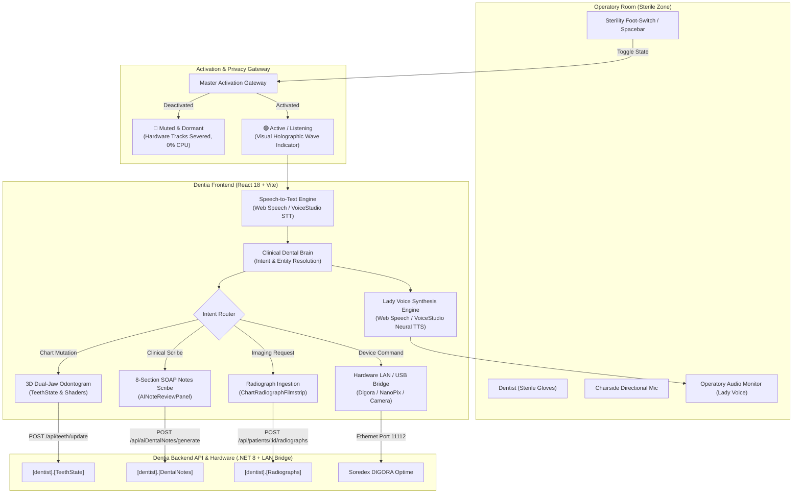
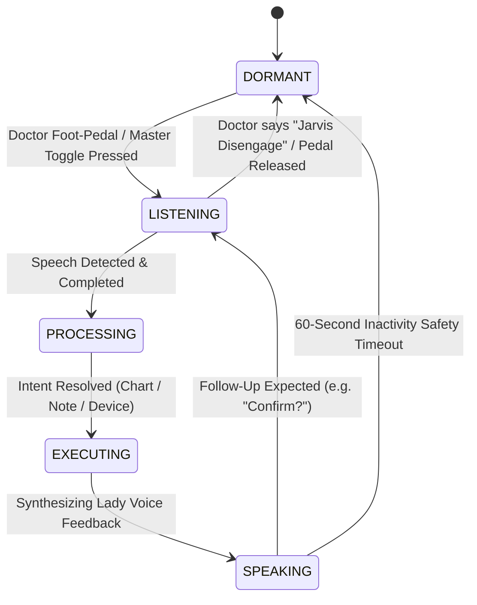
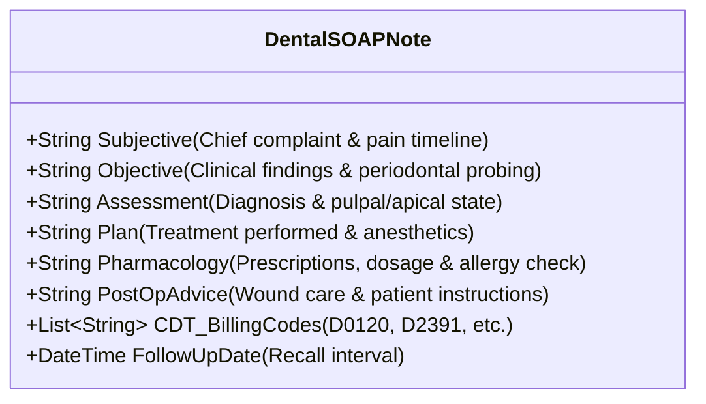
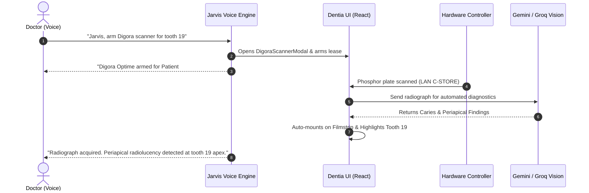
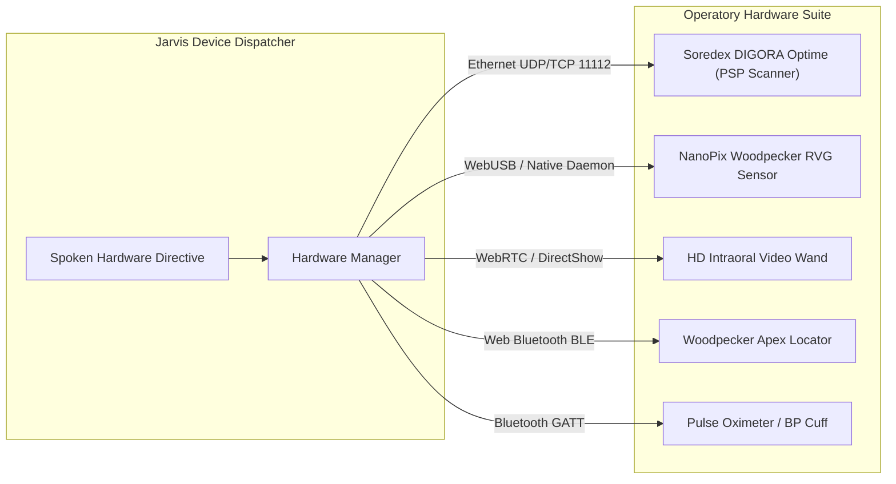
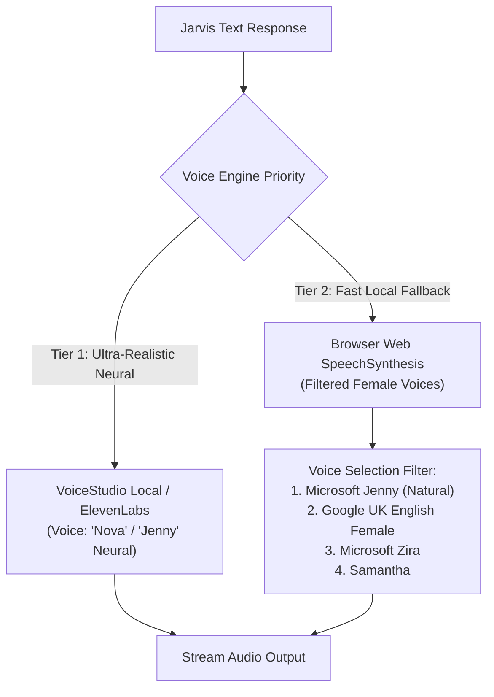
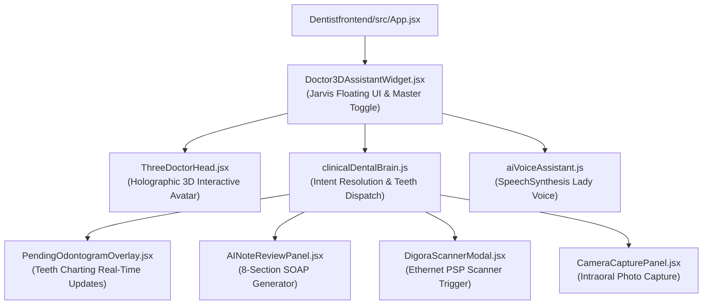

# 🎙️ DENTIA JARVIS — AI Clinical Voice Copilot Architecture & Specification
## Full Hands-Free Operatory Voice Assistant for Dentists (Lady Voice Persona)

> **Document Version**: 1.0.0 (Production Blueprint)  
> **Target Application**: Dentia Dental Practice Workspace (`Dentistfrontend` & `DentistAPIClone`)  
> **Persona**: "Jarvis Clinical" / Female Voice Copilot (Calm, Precise, Professional)  
> **Primary Mandate**: **100% Hands-Free Sterility & Zero Eavesdropping**. Inactive by default; only wakes and executes when explicitly authorized by the treating clinician.

---

## 1. Executive Summary & Core Requirements

In a modern dental operatory, maintaining a **sterile field** is paramount. Once a dentist puts on surgical gloves, touching keyboards, mice, or touchscreens risks cross-contamination (bloodborne pathogens, saliva, aerosols). 

**Dentia Jarvis** solves this by acting as an ultra-intelligent, voice-operated clinical copilot designed specifically for dentists. It allows the clinician to perform all operatory tasks using natural speech:

1. **Doctor-Jarvis Natural Conversation**: Hands-free real-time conversational clinical guidance in a clear, natural **lady voice**.
2. **Real-Time Dental Charting & Tooth Modification**: Live voice commands to mark caries, restorations, RCTs, crowns, and extractions on the 3D dual-jaw odontogram (e.g. *"Mera chart pe ye update karo"*, *"Tooth 14 pe occlusal caries apply karo"*).
3. **Automated Clinical Scribe & 8-Section SOAP Notes**: Automatically structures spoken consultation dialogue into signed clinical SOAP records without manual typing.
4. **Voice-Triggered X-Ray & Imaging Acquisition**: Hands-free capture and upload of radiographs, intraoral camera feeds, and automated AI radiographic analysis.
5. **Chairside Hardware & Device Integration**: Seamless voice control for intraoral PSP scanners (Soredex DIGORA® Optime Ethernet), RVG digital sensors (NanoPix), and intraoral cameras.
6. **Strict Doctor-Controlled Activation (Privacy & Security)**: Complete silence and dormant privacy when idle. Activates **only** via sterile foot-pedal/spacebar, screen toggle, or local wake-phrase.

---

## 2. High-Level System Architecture

---

## 3. Strict Activation & Privacy Lifecycle (No Eavesdropping)

To comply with **HIPAA / GDPR** patient privacy standards and prevent accidental operatory misfires, the assistant operates under a strict **Five-State FSM (Finite State Machine)**:

### State Specifications:
1. **DORMANT / OFF (Default State)**:
   - **Hardware Level**: Microphone stream tracks are strictly closed: `stream.getTracks().forEach(t => t.stop())`.
   - **UI Indicator**: Muted gray/red lock badge: `🔒 JARVIS DORMANT`.
   - **Data Transfer**: Exactly 0 bytes sent over the network. Zero background listening.
2. **ARMED / LISTENING**:
   - **Activation Trigger**: Triggered by a foot-pedal tap, Spacebar keybind, or tapping the on-screen toggle button.
   - **UI Indicator**: Holographic pulsing cyan orb with live frequency wave visualizer.
   - **Audio Cue**: Subtle soft chime indicating readiness.
3. **AUTO-DISENGAGE SAFETY**:
   - If no speech occurs for **60 seconds**, the assistant automatically drops back to `DORMANT` to avoid accidental dictation during private patient discussions.

---

## 4. Voice-Driven Dental Charting Engine ("Mera Chart Update Karo")

Dentists need to update tooth conditions chairside without putting down instruments. Jarvis handles dental terminology in both **English** and **Urdu/Roman Urdu** and maps directly to the 3D dual-jaw odontogram.

### 4.1 Tooth Notation Normalization
The engine automatically recognizes both international systems:
- **Universal Numbering (1 to 32)**: e.g. "Tooth 14", "Tooth number 19", "Upper right first molar".
- **FDI Two-Digit (11 to 48)**: e.g. "Tooth two-four", "Tooth three-six".
- **Deciduous / Pediatric (A to T or 51 to 85)**: e.g. "Primary tooth B", "Milk tooth E".

### 4.2 Five-Surface Anatomical Mapping
- **O**: Occlusal (Biting surface of premolars/molars)
- **M**: Mesial (Surface toward the midline)
- **D**: Distal (Surface away from the midline)
- **B / F**: Buccal / Facial (Cheek side)
- **L / P**: Lingual / Palatal (Tongue or roof of mouth side)
- **Compound**: MOD, MO, DO, MOB, etc.

### 4.3 Voice Command Matrix & Visual Shader Mapping

| Doctor Spoken Command (English & Roman Urdu) | Clinical Intent | Target Tooth | Surfaces | Odontogram Color & Shader | API Action Dispatched |
|---|---|---|---|---|---|
| *"Jarvis, tooth 14 pe occlusal caries mark karo"* | Mark Caries | #14 | Occlusal (O) | Red Pulsing `#EF4444` | Staged &rarr; `POST /api/teeth/update` |
| *"Tooth 19 has distal decay, add to chart"* | Mark Caries | #19 | Distal (D) | Red Pulsing `#EF4444` | Staged &rarr; `POST /api/teeth/update` |
| *"Tooth 30 pe composite filling lagao, MOD"* | Restoration | #30 | M-O-D | Blue Solid `#2563EB` | Staged &rarr; `POST /api/teeth/update` |
| *"Tooth 21 needs root canal, pulp is necrotic"* | Endodontic | #21 | Pulp/Root | Violet Purple `#7C3AED` | Staged &rarr; `POST /api/teeth/update` |
| *"Tooth 36 extracted, mark as missing"* | Extraction | #36 | Entire tooth | Red Crossout `#DC2626` | Staged &rarr; `POST /api/teeth/update` |
| *"Tooth 11 full porcelain crown seated"* | Prosthodontic | #11 | Crown | Amber Gold `#D97706` | Staged &rarr; `POST /api/teeth/update` |
| *"Falan tooth pe ye apply karo: tooth 46 implant placed"* | Implantology | #46 | Fixture | Emerald `#059669` | Staged &rarr; `POST /api/teeth/update` |

### 4.4 Staging & Safety Confirmation Protocol
To prevent unintentional modifications to the legal dental record:
1. When the doctor says: *"Jarvis, mark occlusal caries on tooth 14"*, Jarvis places an **Amber Dashed Marker** on `<PendingOdontogramOverlay />`.
2. Jarvis responds in her lady voice:
   > *"Doctor, staged occlusal decay on tooth 14. Should I commit to the permanent chart?"*
3. The doctor simply says: *"Yes, commit"* or *"Confirm"*.
4. Jarvis writes to `[dentist].[TeethState]` and announces: *"Tooth 14 updated successfully."*

---

## 5. Hands-Free AI Clinical Scribe & SOAP Notes ("Notes Likho")

Jarvis functions as an ambient clinical scribe during surgery or checkups.

### 5.1 The 8-Section Clinical SOAP Note Structure

### 5.2 Conversational Dictation Workflow
1. **Initiate Scribing**:
   - Doctor: *"Jarvis, start clinical note for this patient."*
   - Jarvis: *"Recording clinical dictation, Doctor. Proceed."*
2. **Doctor Speaks Naturally During Surgery**:
   - Doctor: *"Patient presents with acute pain in lower left quadrant. Cold test on tooth 19 elicited lingering pain for 30 seconds. Percussion positive. Administered 1 carpule of 2% Lidocaine with 1:100k epi via IAN block. Completed pulpectomy, working length 21mm verified on apex locator. Temporized with Cavit. Prescribed Ibuprofen 600mg every 6 hours. Patient to return in 1 week for obturation."*
3. **Jarvis Parses & Distributes into 8 Sections**:
   - **Subjective**: "Acute throbbing pain, lower left quadrant (tooth 19)."
   - **Objective**: "Lingering cold response (>30s), percussion sensitive on tooth 19."
   - **Assessment**: "Symptomatic Irreversible Pulpitis with Symptomatic Apical Periodontitis (Tooth 19)."
   - **Plan**: "Emergency Pulpectomy. 1 cartridge 2% Lidocaine 1:100k epi (IANB). WL 21mm. Cavit temporary seal."
   - **Pharmacology**: "Ibuprofen 600mg PO Q6H PRN pain."
   - **CDT Codes**: `D3221` (Pulpal debridement), `D0140` (Limited oral evaluation).
   - **Follow-up**: "1 week for final RCT obturation."
4. **Verbal Review & Sign-Off**:
   - Doctor: *"Jarvis, read back the assessment and plan."*
   - Jarvis (Lady voice reads summary): *"Assessment: Symptomatic irreversible pulpitis on tooth 19. Plan: Pulpectomy completed with Cavit seal. 1 week recall."*
   - Doctor: *"Sign and finalize note."*
   - Jarvis calls `PATCH /api/ai-notes-drafts/:id/sign` and attaches the doctor's cryptographic digital signature.

---

## 6. Voice-Triggered Radiographs & X-Ray Acquisition ("X-Ray Upload Karo")

Eliminating the need to touch imaging panels while holding patient cheek retractors.

### 6.1 Voice Acquisition Workflows

### 6.2 Voice Commands for Imaging
- *"Jarvis, upload new X-ray"* &rarr; Triggers sterile file-drop modal or clipboard paste.
- *"Jarvis, arm Digora scanner"* &rarr; Dispatches `POST /api/hardware/digora/arm`.
- *"Jarvis, switch to intraoral camera"* &rarr; Activates `<CameraCapturePanel />`.
- *"Jarvis, capture frame / snap photo"* &rarr; Freezes camera frame, captures high-res JPEG, and tags it to active patient.
- *"Jarvis, zoom in on tooth 19 radiograph"* &rarr; Triggers inspection zoom on `<ChartRadiographFilmstrip />`.

---

## 7. Chairside Hardware & Device Integration Protocol

Jarvis directly bridges to operatory peripherals via local LAN bridges, WebUSB, and WebRTC:

### 7.1 Peripheral Command Set

| Peripheral Device | Connection Type | Voice Command Example | Jarvis Action & Confirmation |
|---|---|---|---|
| **Soredex DIGORA® Optime** | Ethernet (TCP/IP) | *"Jarvis, connect to Digora"* | Pings `digora_lan_bridge.js`, arms operatory plate slot. Speaks: *"Digora Optime connected on 192.168.1.50. Operatory armed."* |
| **NanoPix RVG Sensor** | USB (WebUSB / Native) | *"Jarvis, arm sensor for bitewing"* | Initializes CMOS sensor calibration. Speaks: *"NanoPix sensor armed. Ready for exposure."* |
| **Intraoral Video Wand** | USB DirectShow / WebRTC | *"Jarvis, take camera picture"* | Captures current 1080p frame from `<CameraCapturePanel />`. Speaks: *"Snapshot saved to patient gallery."* |
| **Electronic Apex Locator** | Web Bluetooth (BLE) | *"Jarvis, what is the working length?"* | Reads millimeter telemetry from BLE GATT characteristic. Speaks: *"Working length reads 20.5 millimeters at apical constriction."* |
| **Vital Signs Monitor** | Web Bluetooth (BLE) | *"Jarvis, check patient vitals"* | Reads heart rate and SpO2. Speaks: *"Heart rate 74 BPM, Oxygen saturation 99%. Stable."* |

---

## 8. Voice Persona & Lady Voice Synthesis Architecture

Jarvis is configured with a high-fidelity **female voice persona** to deliver calm, reassuring, and articulate responses in clinical environments.

### 8.1 Multi-Tier Lady Voice Dispatcher

### 8.2 Lady Voice Tuning Parameters
- **Pitch**: `1.05` (Slightly elevated for crisp phonetic clarity over operatory noise like suction/handpieces).
- **Rate**: `1.02` (Efficient, confident delivery without wasting doctor time).
- **Tone**: Professional, clinical, polite (*"Doctor, occlusal decay marked on tooth 14"*).

---

## 9. Implementation Roadmap & File Blueprint

To deploy this into the existing codebase, the following files work in unison:

### Key File Responsibilities:
1. **[Doctor3DAssistantWidget.jsx](file:///f:/DentistApp_Theme2/Dentistfrontend/src/components/aiDoctor/Doctor3DAssistantWidget.jsx)**:
   - Houses the master `isEnabled` toggle and sterility state manager (`DORMANT` &rarr; `LISTENING`).
   - Renders the interactive glowing holographic avatar and waveform visualizer.
   - Listens for keyboard shortcuts (Spacebar / Foot-pedal switch).
2. **[clinicalDentalBrain.js](file:///f:/DentistApp_Theme2/Dentistfrontend/src/components/aiDoctor/clinicalDentalBrain.js)**:
   - Extended with tooth regex parsers (`tooth 14 caries`, `tooth 19 filling`, `tooth 36 missing`).
   - Dispatches custom browser events: `dentia:chart:update`, `dentia:soap:append`, `dentia:device:arm`.
3. **[aiVoiceAssistant.js](file:///f:/DentistApp_Theme2/Dentistfrontend/src/utils/aiVoiceAssistant.js)**:
   - Contains priority filters for high-fidelity lady voices (`Jenny`, `Zira`, `Google UK English Female`).
4. **[digora_lan_bridge.js](file:///f:/DentistApp_Theme2/digora_lan_bridge.js)**:
   - Handles the low-level DICOM / Ethernet handshake to the physical Soredex Digora machine upon voice command.

---

## 10. Verification & Quality Assurance Protocols

1. **Sterility & Privacy Test**:
   - Load application &rarr; Verify microphone indicator is **completely off** in Chrome/Edge toolbar.
   - Speak without activating &rarr; Verify zero action or network requests.
   - Tap activation toggle &rarr; Verify audio chime and glowing wave indicator.
2. **Odontogram Real-Time Voice Test**:
   - Activate Jarvis and speak: *"Tooth 14 occlusal caries"*.
   - Verify tooth 14 turns amber on the 3D odontogram with confidence tag `95% Caries`.
   - Confirm via voice: *"Commit to chart"* &rarr; Verify shader turns solid red (`#EF4444`) and database updates.
3. **SOAP Scribe Generation Test**:
   - Speak clinical consultation narrative &rarr; Verify auto-population of Subjective, Objective, Assessment, and Plan fields in `<AINoteReviewPanel />`.
4. **Hardware Arming Test**:
   - Speak: *"Jarvis, arm Digora scanner"* &rarr; Verify `<DigoraScannerModal />` opens, operatory lease is confirmed, and status reads `ARMED`.

---
*End of Specification. Approved for Production Engineering.*
