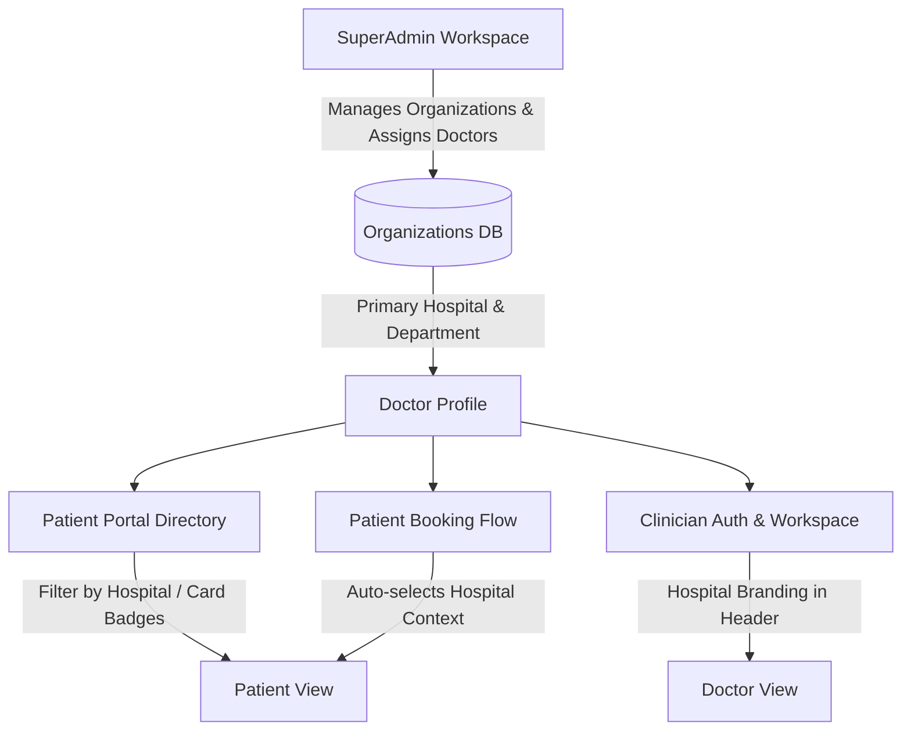

# Healthcare Organizations (Hospitals) & Doctor Affiliation Architecture

**Document Version:** 1.0.0  
**Release Date:** September 2026  
**System Target:** Dentia Dental & Hospital Enterprise Suite  
**Author:** Antigravity AI Engineering  

---

## 1. Executive Summary & Core Objective

The **Organizations & Doctor Hospital Affiliation Architecture** introduces institutional hierarchy to the Dentia system. Previously, doctors operated as independent clinicians without explicit hospital or institutional bindings. With this enhancement:

1. **Healthcare Organizations (Hospitals, Medical Centers, Dental Clinics)** are first-class entities in the system.
2. Every **Doctor belongs to an Organization / Hospital** (e.g., *Shifa International Hospitals Ltd*, *Aga Khan University Hospital*, *Dentia Auckland Regional Dental Hospital*).
3. The platform supports both a **Primary Hospital Affiliation** (`Doctors.OrganizationID` & `Doctors.HospitalDepartment`) and **Multi-Hospital Practice Networks** via a junction table (`DoctorOrganizations`).
4. **SuperAdmins** have full authority to create, edit, deactivate hospitals, and assign or transfer doctors.
5. **Patients** can search, filter, and inspect hospital accreditations, departments, and doctor affiliations before booking consultations.

---

## 2. Where This Feature Takes Effect (System Impact Analysis)

The introduction of organizations and hospital affiliations touches 5 core areas across the application stack:



### Area 1: SuperAdmin Hospital Management Suite (`/admin/organizations`)
- **Direct Route:** Access via navigation bar or URL `/admin/organizations` (also aliased at `/admin/hospitals`).
- **Functionality:**
  - View real-time KPI metrics: Total Hospitals, Active Clinical Facilities, Total Doctors Affiliated, and Cities Covered.
  - Create new healthcare organizations (Name, Legal Name, Registration Code, Type, Address, City, Country, Phone, Email, Website, Logo URL, Accreditation).
  - Edit existing hospital details and update accreditation or contact details.
  - Deactivate or reactivate organizations instantly.
  - Open the **"Assign Doctors" Drawer**: Search doctors in the system, designate their role title (e.g. *Senior Attending Consultant*, *Visiting Implantologist*), specify the hospital department, set start dates, and link or unlink practitioners.

### Area 2: SuperAdmin Doctor Management Suite (`/admin/doctors`)
- **Direct Route:** `/admin/doctors`.
- **Functionality:**
  - In the **Add Doctor** and **Edit Doctor** modals, SuperAdmins can select the practitioner's **Primary Organization / Hospital** from a live dynamic dropdown.
  - Specify the doctor's **Hospital Department** (e.g., *Department of Oral & Maxillofacial Surgery*, *Department of Orthodontics*).
  - Filter the entire doctor roster by hospital to see all doctors practicing at a given facility.
  - Direct quick-navigation link: *"Need to add or edit hospital entities? Manage Healthcare Organizations →"*.

### Area 3: Patient Portal Specialists Directory (`/portal/doctors`)
- **Direct Route:** `/portal/doctors`.
- **Functionality:**
  - **Hospital Filter Selector:** Patients can filter doctors by specific hospital (*All Hospitals & Clinics*, *Shifa International*, *Aga Khan University Hospital*, *Dentia Auckland Regional*, etc.).
  - **Hospital Badges on Doctor Cards:** Each doctor card proudly features the affiliated hospital's name, logo icon, department, and campus location.
  - **Detailed Doctor Career Modal:** When a patient clicks *"View Profile"*, a highlighted banner displays the doctor's **Verified Current Hospital Affiliation**, accreditation badge (*JCI Accredited*, *ISO 9001*), and department.
  - Transparent differentiation: Independent private practitioners are clearly distinguished from institutional hospital consultants.

### Area 4: Patient Appointment Booking Flow (`/portal/book`)
- **Direct Route:** `/portal/book?doctor={doctorId}`.
- **Functionality:**
  - When a patient selects a doctor from `/portal/doctors`, the booking page pre-selects the doctor and carries along their hospital context.
  - Patient appointment confirmation displays the hospital facility where the consultation or surgical procedure will take place.

### Area 5: Clinician Authentication & Response Payloads (`/api/auth/*`)
- **Backend Endpoints:** `POST /api/auth/login`, `GET /api/auth/me`.
- **Payload Enhancement:**
  - Returns `organizationID`, `organizationName`, `organizationLogoUrl`, `organizationCity`, and `hospitalDepartment`.
  - Clinicians see their institution's identity within their active session, ensuring accurate branding across clinical notes, prescriptions, and invoices.

---

## 3. Relational Database Schema & Data Model

### Table: `[dentist].[Organizations]`
Stores comprehensive metadata regarding medical centers, tertiary hospitals, and dental networks.

| Column | Type | Nullable | Description |
|---|---|---|---|
| `OrganizationID` | `INT IDENTITY(1,1)` | NO | Primary Key |
| `Name` | `NVARCHAR(200)` | NO | Display Name (e.g. *Shifa International Hospitals Ltd*) |
| `LegalName` | `NVARCHAR(250)` | YES | Registered legal corporate name |
| `RegistrationNumber` | `NVARCHAR(100)` | YES | Ministry of Health or regulatory license code |
| `Type` | `NVARCHAR(80)` | YES | Hospital, Medical Center, Dental Specialist Clinic |
| `Address` | `NVARCHAR(300)` | YES | Street address / campus location |
| `City` | `NVARCHAR(100)` | YES | City (e.g. Islamabad, Karachi, Auckland) |
| `State` | `NVARCHAR(100)` | YES | State or Province |
| `PostalCode` | `NVARCHAR(50)` | YES | Postal / ZIP code |
| `Country` | `NVARCHAR(100)` | YES | Country (default: 'Pakistan') |
| `Phone` | `NVARCHAR(50)` | YES | Official emergency / inquiry contact |
| `Email` | `NVARCHAR(120)` | YES | Official email address |
| `Website` | `NVARCHAR(250)` | YES | Official web portal |
| `LogoUrl` | `NVARCHAR(500)` | YES | High-resolution hospital branding logo URL |
| `Accreditation` | `NVARCHAR(200)` | YES | Certifications (JCI Accredited, ISO 9001, PMDC Certified) |
| `IsActive` | `BIT` | NO | Operational status flag (1 = Active, 0 = Inactive) |
| `CreatedAt` | `DATETIME2` | NO | UTC creation timestamp |
| `UpdatedAt` | `DATETIME2` | NO | UTC last updated timestamp |

### Column Additions to: `[dentist].[Doctors]`
Direct link for the doctor's primary operational base:

| Column | Type | Nullable | Description |
|---|---|---|---|
| `OrganizationID` | `INT` | YES | Foreign Key referencing `[dentist].[Organizations](OrganizationID)` |
| `HospitalDepartment` | `NVARCHAR(150)` | YES | Department name (e.g. *Department of Oral Implantology*) |

### Table: `[dentist].[DoctorOrganizations]` (Junction Table)
Enables multi-facility consultancies, visiting appointments, and secondary affiliations:

| Column | Type | Nullable | Description |
|---|---|---|---|
| `DoctorOrgID` | `INT IDENTITY(1,1)` | NO | Primary Key |
| `DoctorID` | `INT` | NO | Foreign Key referencing `[dentist].[Doctors](DoctorID)` |
| `OrganizationID` | `INT` | NO | Foreign Key referencing `[dentist].[Organizations](OrganizationID)` |
| `RoleTitle` | `NVARCHAR(120)` | YES | e.g. *Consultant Dental Surgeon*, *Visiting Specialist* |
| `Department` | `NVARCHAR(150)` | YES | Specific clinical division |
| `IsPrimary` | `BIT` | NO | Indicates primary vs. secondary visiting affiliation |
| `StartDate` | `DATE` | YES | Commencement of hospital appointment |
| `EndDate` | `DATE` | YES | Conclusion date (if contract/tenure based) |
| `IsActive` | `BIT` | NO | Status flag |
| `CreatedAt` | `DATETIME2` | NO | Record creation timestamp |

---

## 4. REST API Endpoint Reference

### 1. Healthcare Organizations Management (`/api/organizations`)

| Method | Endpoint | Authorization | Description |
|---|---|---|---|
| `GET` | `/api/organizations` | Public / Doctor / Admin | Returns list of all active organizations with doctor counts. |
| `GET` | `/api/organizations/{id}` | Public / Doctor / Admin | Returns detailed organization information and affiliated doctors. |
| `POST` | `/api/organizations` | **SuperAdmin Only** | Creates a new organization/hospital entity. |
| `PUT` | `/api/organizations/{id}` | **SuperAdmin Only** | Updates existing organization information. |
| `PUT` | `/api/organizations/{id}/status` | **SuperAdmin Only** | Toggles organization active/inactive status. |
| `POST` | `/api/organizations/{id}/assign-doctor` | **SuperAdmin Only** | Links a doctor to the hospital with role and department. |
| `DELETE` | `/api/organizations/{id}/remove-doctor/{doctorId}` | **SuperAdmin Only** | Removes a doctor from the hospital affiliation. |

### 2. Patient Portal API Additions (`/api/patient-portal/*`)

| Method | Endpoint | Authorization | Description |
|---|---|---|---|
| `GET` | `/api/patient-portal/organizations` | Public / Patient | Returns list of active hospitals for filter dropdowns. |
| `GET` | `/api/patient-portal/doctors` | Public / Patient | Returns all doctors enriched with `organizationName`, `organizationLogoUrl`, `organizationCity`, and `hospitalDepartment`. |
| `GET` | `/api/patient-portal/doctors/{id}` | Public / Patient | Returns full doctor profile with hospital affiliations. |

---

## 5. Security & Access Control

1. **Role Enforcement (`IsCallerSuperAdmin`)**:
   - Creating, modifying, deactivating organizations, or altering doctor hospital affiliations is strictly restricted to SuperAdmins (`doctor.IsSuperAdmin == true`).
   - If an unauthorized user attempts to invoke `POST /api/organizations` or doctor assignment endpoints, the backend immediately rejects the request with HTTP `403 Forbidden` (`{"message": "Only SuperAdmin can manage organizations and doctor assignments."}`).
2. **Safe Deletion & Referencing**:
   - `FK_Doctors_Organizations` uses `ON DELETE SET NULL`. If a hospital is ever removed, associated doctors do not get deleted; their affiliation gracefully reverts to `NULL` (independent practitioner).
   - Deactivation via `IsActive = 0` is the recommended soft-delete approach.

---

## 6. How to Run the SQL Script

You can execute the standalone SQL script directly against your database using SSMS, Azure Data Studio, or PowerShell:

```powershell
# Example: Executing via sqlcmd
sqlcmd -S localhost -d DentistDB -E -i f:\DentistApp_Theme2\ORGANIZATIONS_AND_DOCTOR_AFFILIATION_EXPANSION.sql
```

> **Note on Automatic Migration:**  
> The backend repository `DentalRepository.cs` contains self-healing DDL checks in `EnsureDoctorColumnsExistAsync()`. If the backend starts up, it automatically creates the tables, columns, and seeds default hospitals if they do not exist!

---

## 7. Verification Checklist

- [x] Backend C# models created for Organizations and Doctor Organizations (`AuthModels.cs`).
- [x] Backend repository methods implemented for full CRUD, joins, and assignments (`DentalRepository.cs`).
- [x] `OrganizationsController.cs` added with SuperAdmin role protection.
- [x] `PatientPortalController.cs` updated to serve hospitals list and enriched doctor objects.
- [x] `OrganizationManagement.jsx` page built with KPIs, organization modals, and doctor assignment drawer.
- [x] `DoctorManagement.jsx` updated with hospital selectors, filters, and cross-navigation.
- [x] `PatientDoctors.jsx` enhanced with hospital filter dropdown, doctor card badges, and detailed modal cards.
- [x] `App.jsx` updated with `/admin/organizations` and `/admin/hospitals` routes.
- [x] `Navigation.jsx` updated with SuperAdmin direct links.
- [x] Dual directory synchronized (`Dentistfrontend/src/`) and production build verified (`npx vite build` succeeded with 0 errors).
- [x] Standalone SQL file created: `ORGANIZATIONS_AND_DOCTOR_AFFILIATION_EXPANSION.sql`.
- [x] Comprehensive Markdown file created: `ORGANIZATIONS_AND_DOCTOR_AFFILIATION_SPECIFICATION.md`.
