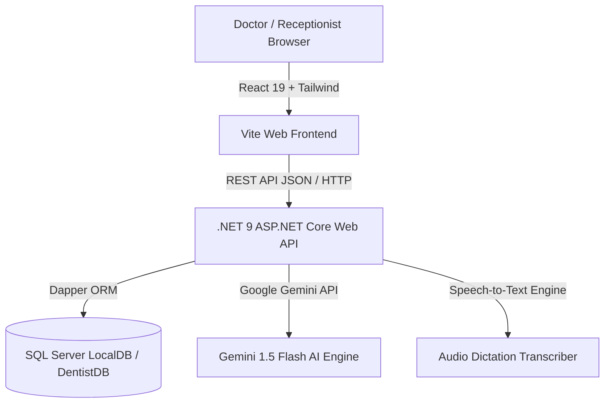

# 🦷 Dental Clinical Management & EHR System (DentistApp)
## Complete Technical Architecture, Page-by-Page Documentation & Clinical User Manual

---

## 📑 Table of Contents
1. [Executive Overview & System Architecture](#1-executive-overview--system-architecture)
2. [Technology Stack & Core Components](#2-technology-stack--core-components)
3. [Database Architecture & SQL Schema](#3-database-architecture--sql-schema)
4. [Comprehensive Page-by-Page & Tab-by-Tab Documentation](#4-comprehensive-page-by-page--tab-by-tab-documentation)
   - [4.1 Patient Directory & EHR Console (`/directory`)](#41-patient-directory--ehr-console-directory)
   - [4.2 Interactive Odontogram Chart & Clinical Workspace (`/chart/:patientId`)](#42-interactive-odontogram-chart--clinical-workspace-chartpatientid)
   - [4.3 Smart Patient Intake & Duplicate Detection (`/new-patient`)](#43-smart-patient-intake--duplicate-detection-new-patient)
   - [4.4 AI Clinical Notes & Voice Dictation (`/ai-notes`)](#44-ai-clinical-notes--voice-dictation-ai-notes)
   - [4.5 Appointment Scheduling & Calendar (`/appointments` & `/book`)](#45-appointment-scheduling--calendar-appointments--book)
   - [4.6 Landing Dashboard & AI Dental Chatbot (`/`)](#46-landing-dashboard--ai-dental-chatbot-)
   - [4.7 Role-Based Doctor & Clinic Administration (`/admin/doctors`)](#47-role-based-doctor--clinic-administration-admindoctors)
5. [Clinical Workflows & Doctor Usage Guide](#5-clinical-workflows--doctor-usage-guide)
6. [API Endpoints Reference](#6-api-endpoints-reference)

---

# 1. Executive Overview & System Architecture

**DentistApp** is an enterprise-grade Dental Electronic Health Record (EHR), Practice Management, and Clinical Decision Support System. It bridges real-time odontogram charting, multi-modality treatment planning, AI-powered patient intake/dictation, and e-prescriptions into a streamlined, reactive interface designed specifically for dentists and dental clinics.



---

# 2. Technology Stack & Core Components

| Layer | Technologies Used | Description |
|---|---|---|
| **Frontend UI** | React 19, Vite, Tailwind CSS, Lucide React Icons, React Router v7 | High-performance single-page application with responsive glassmorphism aesthetic and micro-animations. |
| **Backend API** | ASP.NET Core (.NET 9.0), C# 13, Dapper ORM | RESTful API controllers with dependency injection, SQL connection pooling, and multi-tenant doctor isolation. |
| **Database** | Microsoft SQL Server (LocalDB `DentistDB`) | Relational database schema storing patients, 32-tooth odontogram charts, prescriptions, appointment logs, and clinical audit trails. |
| **AI Subsystem** | Google Gemini API (`gemini-1.5-flash`), Custom Speech Services | Autonomous clinical intake parsing, SOAP note drafting, and intelligent conversational dental assistant. |

---

# 3. Database Architecture & SQL Schema

### Core Tables Summary:
1. **`Doctors`**: Doctor profiles, credentials, region assignments, and SuperAdmin flags.
2. **`Patients`**: Patient demographics, DOB, contact, medical alerts, allergies, `CurrentTreatmentPlan`, `TreatmentStage`, and `TargetShade`.
3. **`TeethState`**: 32-row odontogram states per patient storing `ToothNumber` (1–32), `Status` (`Healthy`, `Damaged / Decay`, `Filled / Restored`, `Missing / Extracted`, `Crown / Bridge`, `Root Canal Treated`), `Color`, and `DoctorComment`.
4. **`ClinicalNotes` / `ClinicalLogs`**: Audit trails of treatment updates, orthodontic adjustments, cosmetic records, and administrative resets.
5. **`Appointments`**: Scheduling records with date, time slot, procedure purpose, and status (`Confirmed`, `Pending`, `Completed`, `Cancelled`).
6. **`Prescriptions`**: Patient medication history with dosages, durations, and instructions.
7. **`Radiographs`**: X-ray image assets, radiograph types (Bitewing, Periapical, Panoramic/OPG), exposure dates, and doctor findings.

---

# 4. Comprehensive Page-by-Page & Tab-by-Tab Documentation

---

## 4.1 Patient Directory & EHR Console (`/directory`)

**URL**: `http://localhost:5173/directory`  
**Purpose**: Primary command center for the practicing doctor during daily clinical consultations.

### Key Sections & Clinical Functionality:

#### 1. Patient Search & Directory Navigation
- **Live Search**: Instant filtering by First Name, Last Name, or Patient ID.
- **Pagination Controls**: Smooth 4-patient cards per view with active selection memory.
- **Doctor Switcher / Region Filter**: Multi-doctor isolation ensuring each doctor views their assigned patients.

#### 2. Patient Clinical Header & Demographics Card
- Displays Patient Photo/Avatar, Full Name, Patient ID, Age, Gender, Date of Birth (DOB), Cell Number, Emergency Contact, and Blood Group.
- **Medical Alerts & Allergies**: Prominently displays critical allergy warnings (e.g. *Penicillin Allergy*, *Hypertension*, *Diabetic*).

#### 3. Consultation Treatment Modality Tagger (Orthodontic, Cosmetic & Restorative)
Allows the dentist to tag and track active treatment modalities in real-time:
- **Braces (Orthodontics) Protocol**:
  - **Treatment Stages**: `Stage 1 (Leveling)`, `Stage 2 (Closure)`, `Stage 3 (Finishing)`.
  - **Archwire Selection**: `0.014 NiTi`, `0.016 NiTi`, `0.016x0.022 SS`, `TMA Wire`.
  - **Persistence**: Clicking *"Save & Update Orthodontic Plan"* updates `CurrentTreatmentPlan` and `TreatmentStage` in SQL, logs a structured entry in `ClinicalNotes`, and immediately reflects on the patient's record.
- **Whitening (Cosmetics) Shade Guide**:
  - **Pre-Shade & Target Shade Selector**: Select starting shade (`A4`, `A3.5`, `A3`, `A2`, `B3`, `C2`) and target shade (`B1`, `BL1`, `BL2`, `A1`, `B2`).
  - **Session Progress**: `Session 1/3`, `Session 2/3`, `Session 3/3`.
  - **Persistence**: Updates cosmetic records in DB with shade progression notes.
- **Cavity (Restorative) Caries Spotter**:
  - **Tooth Selector**: Quick-tag buttons for affected teeth (`#3`, `#8`, `#9`, `#14`, `#19`, `#30`, `#31`).
  - **Restorative Material**: `Composite Resin` vs `Glass Ionomer (GIC)`.
  - **Live Odontogram Sync**: Automatically marks tooth state as `Damaged / Decay` (`#EF4444`) in SQL `TeethState` table, logs the restorative plan, and dynamically recalculates the Health Overview.
- **Smart 15-Second Inactivity Auto-Hide**:
  - Modality drawer automatically collapses after **15 seconds** of inactivity to maximize screen real estate.
  - Active mouse movement or option clicking resets the countdown.
  - Clicking Save collapses the drawer immediately while keeping the active modality highlighted.
- **Active Plan Badge & Single-Click Revert/Reset**:
  - Displays: $\text{Active: } \textbf{Braces (Orthodontics)} \quad \boxed{\textbf{Stage 1 (Leveling)}} \quad \boxed{\mathbf{↺}}$
  - Clicking the **`↺` (RotateCcw)** icon immediately clears the plan from SQL DB, clears the stage, unselects the modality button, and records an administrative audit log.

#### 4. Live Health Overview Infographic
- Real-time animated progress bars computed directly from the patient's 32-tooth records:
  - **Health %**: Percentage of teeth in `Healthy` state.
  - **Caries %**: Percentage of teeth affected by decay.
  - **RCT %**: Root canal treated teeth.
  - **Missing %**: Extracted or congenitally missing teeth.
  - **Crown %**: Prosthodontic crowns and bridge abutments.

#### 5. Appointments & Clinical History Timeline
- Displays upcoming scheduled appointments, treatment notes, doctor timestamps, and visit logs.

---

## 4.2 Interactive Odontogram Chart & Clinical Workspace (`/chart/:patientId`)

**URL**: `http://localhost:5173/chart/14` (where `14` is the Patient ID)  
**Purpose**: High-precision dental charting workspace using the FDI / Universal 32-Tooth Numbering System.

```
   Upper Maxillary Arch (Teeth 1 - 16)
   [ 1][ 2][ 3][ 4][ 5][ 6][ 7][ 8] | [ 9][10][11][12][13][14][15][16]
   -------------------------------------------------------------------
   [32][31][30][29][28][27][26][25] | [24][23][22][21][20][19][18][17]
   Lower Mandibular Arch (Teeth 17 - 32)
```

### Key Tabs & Functionality:

#### Tab 1: 32-Tooth Interactive Odontogram Chart
- **Visual Tooth Rendering**: Realistic anatomical tooth graphics categorized into Upper Maxillary Arch (Teeth 1–16) and Lower Mandibular Arch (Teeth 17–32).
- **Surface Diagnostics**: Clicking any tooth opens the diagnostic inspector allowing the doctor to set:
  - `Healthy` (Clean White `#FFFFFF` / Light Blue `#38BDF8`)
  - `Damaged / Decay (Caries)` (Red `#EF4444`)
  - `Filled / Restored` (Green `#10B981`)
  - `Missing / Extracted` (Gray Outline `#94A3B8` with gap indicator)
  - `Crown / Bridge` (Gold `#F59E0B`)
  - `Root Canal Treated (RCT)` (Purple `#8B5CF6`)
- **Doctor Clinical Comments**: Add custom notes per tooth (e.g. *"Class II DO cavity on distal surface"*).
- **Batch Save**: Saves all 32 tooth states directly to `TeethState` table via `/api/patients/teeth/update-bulk`.

#### Tab 2: Radiographs & Dental X-Ray Viewer
- **High-Definition X-Ray Display**: View panoramic (OPG), bitewing, periapical, and cephalometric radiographs.
- **Image Manipulation Tools**: Zoom in/out, pan, brightness/contrast adjustments, and grayscale inversion for detecting subtle periapical radiolucencies or bone loss.
- **Radiographic Findings Log**: Record doctor findings attached to specific exposure dates.

#### Tab 3: Prescriptions & Medication Generator
- **Instant e-Prescribing**:
  - Add medicine name (e.g. *Amoxicillin 500mg*, *Ibuprofen 400mg*, *Augmentin 625mg*).
  - Select Dosage, Frequency (e.g. *TDS - 3 times daily after meals*), and Duration (e.g. *5 Days*).
  - Special Instructions (e.g. *"Take with food. Complete the full course."*).
- **Print / PDF Generation**: Generates official clinic prescription slips with doctor registration number, clinic logo, and date.

#### Tab 4: Treatment Plans & Financial Estimator
- Itemized clinical procedures (e.g. *Scaling & Polishing*, *Composite Restoration*, *Zirconia Crown*, *Implant Placement*).
- Associate procedures with specific tooth numbers and set estimated costs.
- Track status: `Proposed`, `Accepted`, `In-Progress`, `Completed`.

#### Tab 5: Clinical Notes & SOAP Records
- Formal dental EHR charting: **S**ubjective, **O**bjective, **A**ssessment, **P**lan.
- Historical audit log with doctor identity and exact timestamps.

---

## 4.3 Smart Patient Intake & Duplicate Detection (`/new-patient`)

**URL**: `http://localhost:5173/new-patient`  
**Purpose**: Multi-modal registration portal for new patients with AI dictation and robust duplicate prevention.

### Key Features:
1. **Intelligent Duplicate Prevention Algorithm**:
   - **Sibling/Family Exception**: Allows multiple sibling patients (different names/DOB) to share their father's/guardian's mobile phone number without blocking registration.
   - **True Duplicate Detection**: Prevents registration only if **First Name + Last Name + Date of Birth** match an existing record, or if an exact person duplicate is detected.
2. **AI Voice & Text Clinical Intake**:
   - Doctor or receptionist speaks or pastes unstructured text (e.g. *"Register Fatima Zahra, 24 years old female, phone 03001234567, severe toothache in lower right molar, allergic to penicillin."*).
   - Gemini AI autonomously extracts and maps fields: `firstName`, `lastName`, `dob`, `gender`, `cellNumber`, `chiefComplaint`, `medicalAlerts`.
3. **Automatic Baseline Generation**:
   - Instantly generates all 32 teeth rows in `TeethState` table with `Healthy` status upon creation.

---

## 4.4 AI Clinical Notes & Voice Dictation (`/ai-notes`)

**URL**: `http://localhost:5173/ai-notes`  
**Purpose**: AI-powered ambient clinical documentation assistant.

### Key Features:
- **Audio Dictation**: Dentists can record post-procedure voice notes hands-free.
- **Automated Transcription & Structuring**: Converts spoken clinical dictation into structured SOAP notes:
  - *Chief Complaint*
  - *Clinical Findings & Caries Index*
  - *Procedures Performed*
  - *Post-Operative Instructions & Prescriptions*
- **EHR Integration**: One-click sync into the patient's permanent clinical chart.

---

## 4.5 Appointment Scheduling & Calendar (`/appointments` & `/book`)

**URL**: `http://localhost:5173/appointments` and `http://localhost:5173/book`  
**Purpose**: Full calendar and appointment management module.

### Key Features:
- **Slot Collision Prevention**: Prevents double-booking across doctors and operatories.
- **Status Workflows**: `Confirmed`, `In-Waiting`, `In-Chair`, `Completed`, `No-Show`, `Cancelled`.
- **Quick Booking from Patient Directory**: Pre-fills patient details for rapid scheduling.

---

## 4.6 Landing Dashboard & AI Dental Chatbot (`/`)

**URL**: `http://localhost:5173/`  
**Purpose**: Clinic portal, doctor KPIs, and 24/7 patient conversational assistant.

### Key Features:
- **Practice Analytics**: Real-time counter of total registered patients, active consultations, and today's appointments.
- **Hero Image Carousel**: Smooth 3.5s auto-sliding clinic presentation.
- **AI Dental Assistant (Chatbot)**:
  - Answers patient inquiries regarding dental treatments, clinic timings, pricing estimates, and emergency advice.
  - Powered by Gemini 1.5 with specialized dental prompt templates.

---

## 4.7 Role-Based Doctor & Clinic Administration (`/admin/doctors`)

**URL**: `http://localhost:5173/admin/doctors`  
**Purpose**: SuperAdmin portal for managing multi-doctor clinic practices.

### Key Features:
- Doctor account provisioning with hashed credentials (`BCrypt`).
- Practice region and operatory assignment.
- Role-based route guards protecting clinical EHR data.

---

# 5. Clinical Workflows & Doctor Usage Guide

### Typical Daily Consultation Workflow:

```mermaid
sequenceDiagram
    autonumber
    actor D as Doctor
    participant UI as Patient Directory (/directory)
    participant CH as Chart Workspace (/chart/:id)
    participant DB as SQL Server Database

    D->>UI: Select Patient from Directory (e.g. Tariq Mehmood)
    UI->>DB: GET /api/patients/14 (Loads Demographics & Saved Plan)
    UI->>DB: GET /api/patients/14/chart (Loads 32-Tooth States)
    UI-->>D: Display Patient Profile, Active Plan & Health Overview

    alt Patient Needs Orthodontic Adjustment
        D->>UI: Click "Braces" -> Select "Stage 1 (Leveling)" & "0.014 NiTi"
        D->>UI: Click "Save & Update Orthodontic Plan"
        UI->>DB: POST /api/patients/14/treatment-plan
        UI->>DB: POST /api/patients/14/clinical-logs
        UI-->>D: Drawer auto-hides; Active badge updates to "Stage 1 (Leveling)"
    else Doctor Mistakes Entry
        D->>UI: Click single-click [↺] Revert Icon
        UI->>DB: POST /api/patients/14/treatment-plan (Resets to NULL)
        UI-->>D: Plan cleared immediately from UI and Database
    end

    D->>CH: Click "Full Chart & Odontogram" -> Navigates to /chart/14
    D->>CH: Inspect Tooth #14 -> Mark "Damaged / Decay" -> Add Restorative Note
    D->>CH: Open "Prescriptions" Tab -> Prescribe Amoxicillin 500mg -> Print
    D->>CH: Open "X-Ray" Tab -> Review Bitewing Radiograph
```

---

# 6. API Endpoints Reference

| HTTP Verb | Endpoint | Purpose | Request / Response Payload |
|---|---|---|---|
| `GET` | `/api/patients/doctor/{docId}` | Fetch all patients assigned to doctor | Returns list of Patient objects |
| `GET` | `/api/patients/{id}` | Get full patient profile & treatment plan | Returns Patient details with `CurrentTreatmentPlan`, `TreatmentStage` |
| `POST` | `/api/patients` | Register new patient (with duplicate check) | `{ firstName, lastName, dob, cellNumber, gender, ... }` |
| `POST` | `/api/patients/{id}/treatment-plan` | Update or reset active treatment plan | `{ treatmentPlan: "Braces", treatmentStage: "Stage 1", targetShade: "0.014 NiTi" }` |
| `POST` | `/api/patients/{id}/clinical-logs` | Insert clinical log audit record | `{ doctorID: 1, message: "Orthodontic wire changed", logType: "Orthodontics" }` |
| `GET` | `/api/patients/{id}/chart` | Fetch 32-tooth odontogram state | Returns array of 32 `TeethState` rows |
| `POST` | `/api/patients/teeth/update-bulk` | Bulk update tooth status and colors | `{ patientId: 14, updates: [{ toothNumber: 14, color: "#EF4444", status: "Damaged / Decay" }] }` |
| `GET` | `/api/patients/{id}/prescriptions` | Retrieve medication history | Returns array of Prescription records |
| `POST` | `/api/patients/prescriptions` | Issue new electronic prescription | `{ patientId: 14, medicineName: "Augmentin", dosage: "625mg", frequency: "BD" }` |
| `GET` | `/api/radiographs/patient/{id}` | Get all X-ray records for patient | Returns list of Radiograph images & notes |
| `POST` | `/api/chatbot/ask` | Send query to Gemini AI Dental Bot | `{ message: "What causes bleeding gums?" }` |

---

*Documentation maintained for DentistApp Enterprise EHR Platform.*
