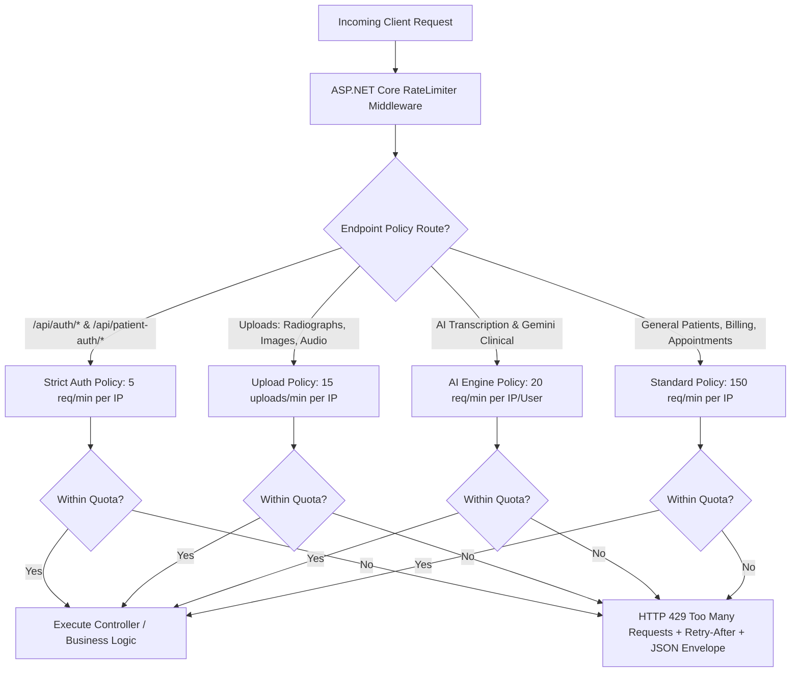
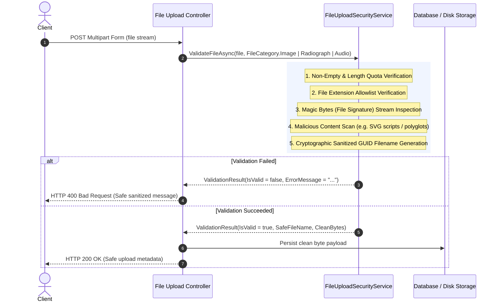
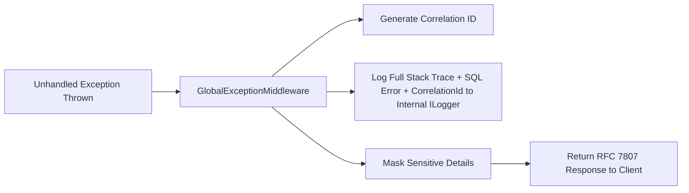
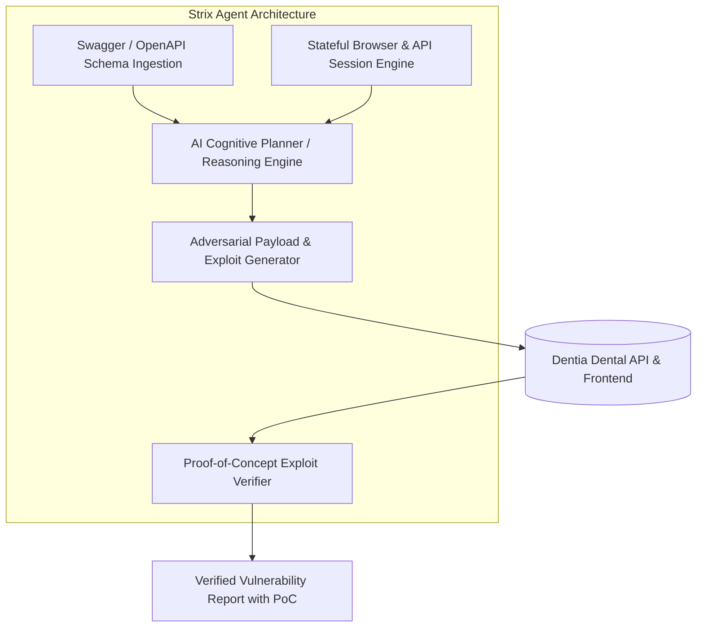

# Enterprise Security Hardening Architecture & Implementation Plan
**Project:** Dentia Dental Clinic Workspace & Clinical PMS (`DentistApp_Theme2`)  
**Components:** `DentistAPI` (ASP.NET Core Web API), `Dentistfrontend` (React + Vite)  
**Date:** September 28, 2026  
**Status:** Architectural Specification & Implementation Blueprint

---

## 1. Executive Summary

This specification addresses four critical enterprise security requirements for the Dentia Dental Clinic Platform:
1. **API Rate Limiting**: Mitigating brute-force attacks on authentication endpoints, credential stuffing, scraping of sensitive patient/doctor records, and DoS attacks.
2. **File Upload Security**: Enforcing strict MIME validation, magic-byte inspection, file size quotas, path traversal defense, and Stored XSS prevention across Profile Images, Radiographs/DICOM, and Clinical Audio.
3. **Robust Error Handling & Information Leakage Prevention**: Eliminating raw exception exposures (`ex.Message`, database schema details, file system paths) by implementing a centralized RFC 7807 ProblemDetails middleware with cryptographic correlation IDs.
4. **Strix Security Evaluation**: Analyzing the benefits, architecture, and integration roadmap of the **Strix AI Penetration Testing Agent** to autonomously uncover vulnerabilities before clinical production release.

---

## 2. API Rate Limiting Architecture

### 2.1 Threat Vector & Current Exposure
- Currently, `/api/auth/login`, `/api/auth/register`, and `/api/patient-auth/login` have **no rate limiting**. An attacker can execute automated dictionary or credential stuffing attacks at hundreds of requests per second.
- Media upload endpoints (`/api/patients/{id}/profile-image`, `/api/radiographs`, `/api/ai-notes/recordings`) lack throttling, enabling storage exhaustion and CPU starvation (via Gemini Vision / Speech-to-Text inference overload).

### 2.2 Rate Limiting Policy Design
Using native `Microsoft.AspNetCore.RateLimiting` in ASP.NET Core, we configure four partitioned rate-limiting tiers partitioned by Client IP and Authenticated User ID:



### 2.3 Policy Configurations

| Policy Name | Target Endpoints | Algorithm | Window | Limit | Queue Limit | Penalty / Header |
| :--- | :--- | :--- | :--- | :--- | :--- | :--- |
| **`auth-strict`** | `/api/auth/login`, `/api/auth/register`, `/api/patient-auth/*` | Sliding Window | 1 Minute | 5 requests | 0 (No queueing) | `Retry-After: 60`, 429 JSON |
| **`upload-secure`** | `POST .../profile-image`, `POST .../radiographs`, `POST .../recordings` | Token Bucket | 1 Minute | 15 tokens (replenish 5/20s) | 2 | `Retry-After: 30`, 429 JSON |
| **`ai-inference`** | `/api/ai-notes/*`, `/api/chatbot/*` | Sliding Window | 1 Minute | 20 requests | 2 | `Retry-After: 45`, 429 JSON |
| **`api-global`** | All other `/api/*` endpoints | Fixed Window | 1 Minute | 150 requests | 10 | `Retry-After: 15`, 429 JSON |

### 2.4 Rejection Response Specification (HTTP 429)
When a client violates a rate limit, the API will not return a blank or HTML page; it returns a standardized JSON response:
```json
{
  "statusCode": 429,
  "error": "Too Many Requests",
  "message": "Rate limit exceeded. Please wait before making additional requests.",
  "retryAfterSeconds": 60,
  "policy": "auth-strict",
  "timestamp": "2026-09-28T06:15:00Z"
}
```

---

## 3. Comprehensive File Upload Security

### 3.1 Current Vulnerabilities Identified
1. **Client Content-Type Trust**: In `PatientsController.cs`, line 864, validation checks `file.ContentType.ToLower()` against an allowlist. The `Content-Type` header is completely controlled by the client; an attacker uploading `shell.aspx` or an executable can trivially pass `Content-Type: image/jpeg`.
2. **SVG Stored XSS**: SVG (`image/svg+xml`) was allowed in `PatientsController`. SVGs can embed arbitrary JavaScript (`<script>` or `<svg onload=...>`). When loaded directly or viewed in the patient portal, this triggers Stored Cross-Site Scripting (XSS) in the context of the medical staff.
3. **No Magic-Byte Inspection**: `RadiographsController.cs` performs zero file signature checks.
4. **Filename Path Traversal**: Raw file names (`file.FileName`) can contain `../` or null bytes, risking directory traversal if files are saved to disk.

### 3.2 Secure File Validation Architecture



### 3.3 Magic-Byte Signatures (File Signatures Matrix)

| Format | Allowed Extensions | File Size Limit | Magic Bytes / Header Signature |
| :--- | :--- | :--- | :--- |
| **JPEG** | `.jpg`, `.jpeg` | 5 MB (Profile), 15 MB (X-ray) | `FF D8 FF` |
| **PNG** | `.png` | 5 MB (Profile), 15 MB (X-ray) | `89 50 4E 47 0D 0A 1A 0A` |
| **WebP** | `.webp` | 5 MB (Profile), 15 MB (X-ray) | `52 49 46 46` (Bytes 0-3) + `57 45 42 50` (Bytes 8-11) |
| **DICOM** | `.dcm`, `.dicom` | 25 MB | `44 49 43 4D` ("DICM" at offset 128) or standard preamble |
| **WebM Audio** | `.webm` | 25 MB | `1A 45 DF A3` (EBML Header) |
| **WAV Audio** | `.wav` | 25 MB | `52 49 46 46` (RIFF) + `57 41 56 45` (WAVE) |
| **MP3 Audio** | `.mp3` | 25 MB | `49 44 33` (ID3 tag) or `FF FB` / `FF F3` (MPEG sync) |
| **Ogg Audio** | `.ogg`, `.oga` | 25 MB | `4F 67 67 53` (OggS) |

> [!CAUTION]
> **SVG Elimination:** SVG (`.svg`) files are strictly barred from avatar and clinical attachments due to intrinsic XML script execution vectors (Stored XSS).
> **Filename Scrubbing:** Original file names are stripped. Storage will use `Guid.NewGuid().ToString("N") + validExtension`.

---

## 4. Error Handling & Information Leakage Prevention

### 4.1 Current Information Leakage Vectors
Multiple endpoints in `RadiographsController.cs`, `AIDentalNotesController.cs`, and `AppointmentsController.cs` contain patterns such as:
```csharp
catch (Exception ex)
{
    return StatusCode(500, $"Internal server error: {ex.Message}");
}
```
**Why this is dangerous:**
- Under database connection timeouts or SQL errors, `ex.Message` returns:
  - Database table names, column names, foreign key constraints (`FK_Appointments_Patients`).
  - Database server IP, port, or SQL instance name (`DENTIA-SQL-01\SQLEXPRESS`).
  - Local disk directory paths (`f:\DentistApp_Theme2\...` or `C:\Users\haider.ali\...`).
- Attackers exploit these details to map backend architecture, bypass security filters, or craft targeted SQL injections.

### 4.2 Zero-Leakage Architecture
1. **Centralized Global Exception Middleware**: Catches all unhandled exceptions at the top of the HTTP pipeline.
2. **Correlation / Incident Tracking ID**: Every request receives a unique `CorrelationId` (e.g. `trace-a7b9-49f2-...`).
3. **Structured Server-Side Logging**: The raw exception, stack trace, SQL query state, and user context are logged internally via `ILogger` into the secure server log with the `CorrelationId`.
4. **Sanitized Client Envelope**: The client receives a zero-information generic payload referencing only the `CorrelationId`.



#### Standard Client Error Response (RFC 7807 Problem Details):
```json
{
  "type": "https://tools.ietf.org/html/rfc7231#section-6.6.1",
  "title": "An unexpected error occurred",
  "status": 500,
  "detail": "A server error occurred while processing your request. Please quote the correlation reference ID to your administrator.",
  "instance": "/api/patients/38/radiographs",
  "correlationId": "cor-6f92a10d-71b4-4b5c-897e-128a55928d11",
  "timestamp": "2026-09-28T06:15:30.124Z"
}
```

---

## 5. Strix AI Security Agent: Value & Benefits for Dentia

### 5.1 What is Strix?
**Strix** is an open-source, autonomous AI penetration testing agent designed to autonomously assess web applications and APIs. Unlike traditional static scanners (which only parse source code) or basic fuzzers (which mindlessly send invalid strings), Strix acts like an **adversarial ethical hacker powered by LLM reasoning**:
- It reads API contracts (OpenAPI/Swagger).
- It explores stateful user workflows (e.g., login -> book appointment -> view chart -> alter bill).
- It generates context-aware, creative exploit vectors to test authorization boundaries, business logic, and data validation.



### 5.2 Key Benefits of Adding Strix to Dentia

#### 1. Autonomous Detection of BOLA / IDOR (Broken Object Level Authorization)
- **Dental Risk**: In Dentia, patient records (`/chart/:id`, `/api/patients/{id}`) and financial invoices (`/api/billing/invoices/{id}`) must be strictly segregated. If Doctor A or Patient B modifies the route parameter from `id=36` to `id=38`, can they view or modify another patient's dental chart?
- **Strix Benefit**: Strix registers multiple low-privilege test personas and automatically tests cross-tenant and horizontal privilege escalation across all patient endpoints.

#### 2. Business Logic Flaw Discovery
- **Dental Risk**: Traditional DAST scanners cannot understand workflows like: "Can a user book an appointment, cancel it, but retain the clinical hold?" or "Can a user submit a treatment plan with negative pricing?"
- **Strix Benefit**: Strix understands domain workflows and tests race conditions, discount manipulation, and clinical state transitions.

#### 3. Continuous CI/CD Pentesting (DevSecOps)
- **Dental Risk**: Manual penetration tests are conducted once a year and cost $15,000–$40,000. Features deployed between pentests remain untested.
- **Strix Benefit**: Strix can be containerized and executed in GitHub Actions or staging environments after every build, blocking PRs if high-severity vulnerabilities are discovered.

#### 4. HIPAA & Health Data Compliance Validation
- **Dental Risk**: HIPAA requires technical safeguards against unauthorized Protected Health Information (PHI) disclosures (45 CFR § 164.312).
- **Strix Benefit**: Strix validates that all PHI endpoints reject unauthenticated or expired JWTs and verifies that rate limits prevent mass patient data harvesting.

#### 5. Zero False-Positive Proofs of Exploit (PoC)
- Traditional scanners dump hundreds of warning flags (90% false positives) that overwhelm developers.
- Strix executes safe, benign proofs-of-concept; if it reports an issue (e.g. rate limit bypass or file upload bypass), it provides the exact HTTP sequence that succeeded.

---

## 6. Implementation Roadmap

### Phase 1: API Rate Limiting Middleware (`DentistAPI/Program.cs`)
- Register `builder.Services.AddRateLimiter(...)` with `auth-strict`, `upload-secure`, `ai-inference`, and `api-global` policies.
- Configure custom 429 rejection handler returning structured JSON with `Retry-After`.
- Annotate controllers/actions with `[EnableRateLimiting("...")]`.

### Phase 2: File Upload Security Service (`DentistAPI/Services/FileUploadSecurityService.cs`)
- Implement `IFileUploadSecurityService` with magic-byte validation, extension whitelist, and size caps.
- Update `PatientsController.cs` (`UploadProfileImage`), `RadiographsController.cs` (`UploadRadiograph`), and `AIDentalNotesController.cs` (`ProcessRecording`).
- Eliminate `.svg` upload permissions and replace uncleaned file names with secure GUIDs.

### Phase 3: Global Exception & Information Masking Middleware (`DentistAPI/Services/GlobalExceptionMiddleware.cs`)
- Intercept all unhandled exceptions.
- Attach `X-Correlation-Id` to response headers.
- Log error details server-side with correlation keys.
- Scrub and standardize all `catch (Exception ex)` blocks across controllers to ensure no raw `ex.Message` is returned to clients.

### Phase 4: Verification & Strix Integration Setup
- Verify with curl / automated tests:
  - 6 rapid login requests trigger HTTP 429.
  - Uploading a `.php` file or `.exe` masked as `.jpg` triggers HTTP 400 with magic-byte failure.
  - Provoking a database or runtime error produces clean 500 JSON without database details or stack traces.
- Provide Strix configuration Dockerfile / CLI setup script for automated pentest runs against Dentia.
