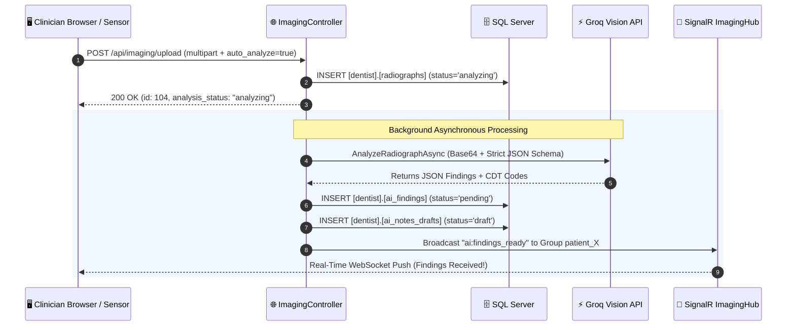

# 🚀 Step 10 Implementation — Backend Imaging Ingestion, Groq Vision Service & SignalR Hub

> **Status**: Completed ✅  
> **Date**: September 2026  
> **Focus**: `ImagingController.cs`, `GroqVisionService.cs`, and `ImagingHub.cs` real-time notification gateway.

---

## 1. Summary of Changes

In this step, we implemented the backend ingest and Groq AI Vision pipeline in ASP.NET Core:

1. **Created `ImagingController.cs`**:
   - `POST /api/imaging/upload`: Ingests multipart images/videos from intraoral cameras (UVC) or sensor export directories (Woodpecker, Vatech, Eighteeth).
     - Saves physical files securely in `wwwroot/uploads/imaging/patient_{id}/`.
     - Creates `[dentist].[radiographs]` record with `analysis_status = 'pending'`.
     - Fires background `GroqVisionService.AnalyzeRadiographAsync()` asynchronously without blocking HTTP response.
   - `GET /api/imaging/{patientId}`: Retrieves paginated radiographs with filtering by modality and brand.
   - `GET /api/imaging/file/{radiographId}`: Streams radiograph files with patient authorization checks.

2. **Implemented `GroqVisionService.cs`**:
   - Uses Groq Vision Cloud API (`llama-3.2-11b-vision-preview`).
   - Strict JSON Schema extraction for dental observations:
     - Constrains vocabulary to: `caries`, `periapical radiolucency`, `bone loss`, `fracture`, `calculus`, `restoration`, `missing tooth`, `implant`, `impaction`.
     - Extracts per-tooth surfaces: `["M", "O", "D", "B", "L"]` and confidence scores (0.0 to 1.0).
   - Inserts staged findings into `[dentist].[ai_findings]` (`status = 'pending'`).
   - Automatically drafts an 8-section clinical SOAP note into `[dentist].[ai_notes_drafts]`.

3. **Created `ImagingHub.cs` (SignalR Gateway)**:
   - Endpoint: `/hubs/imaging`.
   - Real-time event broadcasting to clinician browser tabs:
     - `imaging:new`: Broadcasts arrival of new scans (e.g. from sensors).
     - `ai:findings_ready`: Pushes analyzed findings immediately to active patient charts.
     - `ai:analysis_failed`: Graceful error push on analysis exceptions.

---

## 2. Sequence Diagram: Ingestion to Real-Time Push



---

## 3. Endpoints & Payloads

### `POST /api/imaging/upload`
```http
POST /api/imaging/upload HTTP/1.1
Content-Type: multipart/form-data; boundary=----Boundary

------Boundary
Content-Disposition: form-data; name="File"; filename="intraoral_snap.jpg"
Content-Type: image/jpeg

[binary image data]
------Boundary
Content-Disposition: form-data; name="PatientId"

5
------Boundary
Content-Disposition: form-data; name="Modality"

intraoral_photo
------Boundary
Content-Disposition: form-data; name="SourceDeviceBrand"

Apple Dental
------Boundary
Content-Disposition: form-data; name="AutoAnalyze"

true
------Boundary--
```
