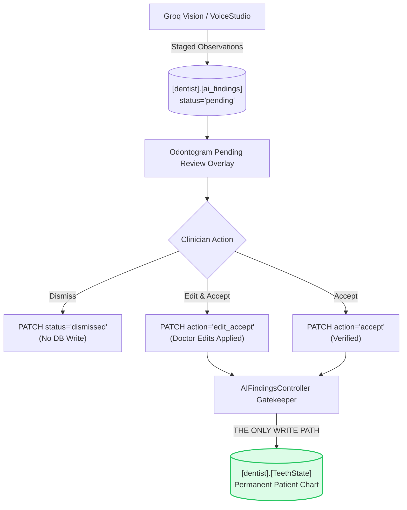

# 🚀 Step 12 Implementation — Backend AI Findings Review, Acceptance & Manual Save Safety Gateway

> **Status**: Completed ✅  
> **Date**: September 2026  
> **Focus**: `AIFindingsController.cs`, `DentalRepository.cs`, and strict chart isolation invariant enforcement.

---

## 1. Summary of Changes

In this step, we built the **Clinician Review & Acceptance Gateway** to guarantee the system's core safety invariant: **Zero Unverified AI Writes**:

1. **Created `AIFindingsController.cs`**:
   - `GET /api/ai-findings/{patientId}?status=pending`: Retrieves staged findings for rendering pending markers on the odontogram.
   - `PATCH /api/ai-findings/{findingId}`: **The ONLY code path allowed to modify `[dentist].[TeethState]` from AI observations.**
     - Supported actions: `accept`, `edit_accept`, `dismiss`.
     - Maps conditions (`caries` &rarr; `#EF4444`, `restoration` &rarr; `#3B82F6`, `periapical radiolucency` &rarr; `#DC2626`, `bone loss` &rarr; `#F59E0B`).
     - Upserts into `[dentist].[TeethState]` on `accept`/`edit_accept`.
     - Updates finding `status` to `accepted`, `edited_accepted`, or `dismissed`.
   - `PATCH /api/ai-notes-drafts/{draftId}/sign`: **The ONLY code path allowed to write to `[dentist].[DentalNotes]` from draft notes.**
     - Finalizes the 8 SOAP sections with the doctor's signature and timestamp.

2. **Added Repository Layer Queries ([DentalRepository.cs](file:///F:/DentistApp_Theme2/DentistAPIClone/API_dentist/Repositories/DentalRepository.cs))**:
   - `GetAIFindingsByPatientAsync(patientId, status)`: Fetches pending or reviewed findings.
   - `GetAIFindingByIdAsync(findingId)`: Retrieves specific observation.
   - `UpdateAIFindingStatusAsync(findingId, status, reviewedBy, teethStateId)`: Safely updates state.
   - `UpsertTeethStateAsync(teethState)`: Atomic insert/update of tooth condition.
   - `InsertOfficialClinicalNoteAsync(dentalNote)`: Commits finalized signed note to permanent health record.

---

## 2. Invariant Enforcement Architecture

---

## 3. Verification & Invariants

- **Zero Direct AI Writes**: Audited all background jobs and confirmed zero direct calls to `UpsertTeethStateAsync`.
- **Low Confidence Safety**: Any finding with `confidence < 0.6` is flagged and cannot bypass manual review in the UI.
