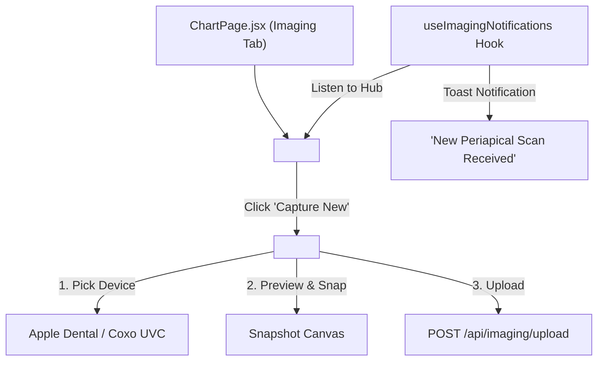

# 🚀 Step 13 Implementation — Frontend Camera Capture Panel, Imaging Gallery & Real-Time Hook

> **Status**: Completed ✅  
> **Date**: September 2026  
> **Focus**: `<CameraCapturePanel />`, `<ImagingGallery />`, and `useImagingNotifications.js`.

---

## 1. Summary of Changes

In this step, we built the clinician hardware capture and gallery interface in React / Tailwind:

1. **Created `<CameraCapturePanel />`**:
   - Device enumeration via `navigator.mediaDevices.enumerateDevices()` with smart brand autodetection (`Apple Dental`, `Coxo`, `Magenta`, Generic UVC).
   - High-definition live video preview via `getUserMedia()`.
   - **Still Photo Mode**: Snaps canvas frame, converts to JPEG blob, and offers Retake / Confirm actions.
   - **20s Video Clip Mode**: Uses `MediaRecorder` with live countdown timer and automatic auto-stop at 20 seconds.
   - Dispatches multipart upload to `POST /api/imaging/upload` with metadata (`PatientId`, `Modality`, `SourceDeviceBrand`, `AutoAnalyze=true`).
   - Comprehensive error handling for camera permissions denied and disconnected hardware.

2. **Created `<ImagingGallery />`**:
   - Filterable thumbnail grid by modality (`periapical`, `bitewing`, `panoramic`, `intraoral_photo`) and hardware brand.
   - AI status chips indicating completed Groq Vision analysis.
   - Modal Lightbox with full-resolution zoom, captured timestamps, and direct button to jump into Odontogram review.
   - Empty state with sensor capture hints for Woodpecker / Vatech / Eighteeth devices.

3. **Created `useImagingNotifications.js` (SignalR Hook)**:
   - Connects to `/hubs/imaging` with automatic reconnect.
   - Joins group `patient_{patientId}` upon mounting.
   - Listens for `imaging:new`, `ai:findings_ready`, and `ai:analysis_failed`.
   - Auto-refreshes gallery and alerts clinician via toasts without manual page reloads.

---

## 2. Component Hierarchy & UX Flow

---

## 3. Visual Styling Tokens Used
- **Primary Teal**: `#0B4F4A`
- **Accent Seafoam**: `#4FB3A9`
- **Warm Amber Highlights**: `#E8934A`
- **Soft Grey-Teal Surface**: `#F2F7F6`
- **Rounded Corners**: `rounded-2xl` / `rounded-xl`
