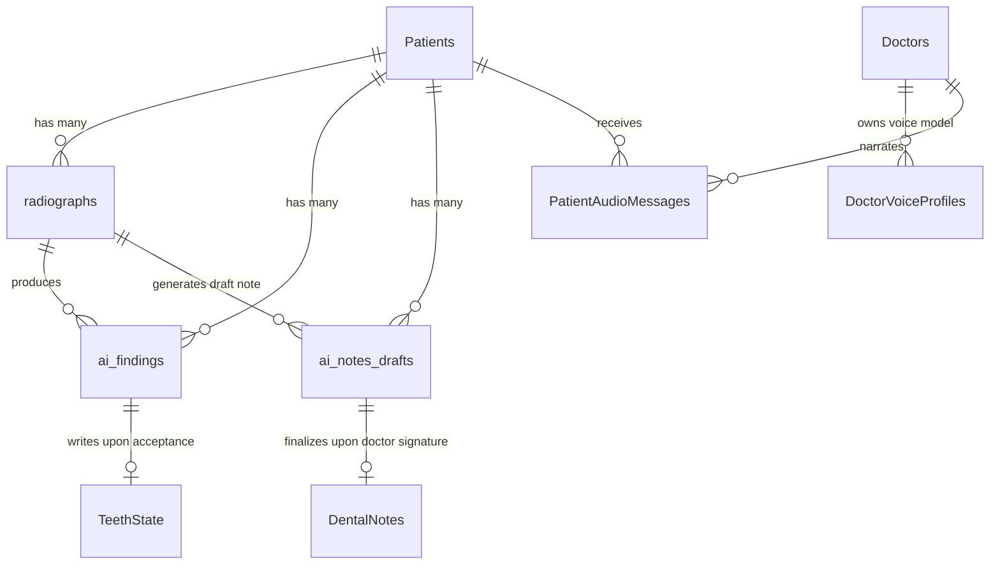

# 🚀 Step 9 Implementation — Imaging & VoiceStudio Database Schema, Models & DTOs

> **Status**: Completed ✅  
> **Date**: September 2026  
> **Focus**: SQL migration, C# entity models, repository methods, and DTO contracts for Imaging, Groq Vision, and VoiceStudio AI.

---

## 1. Summary of Changes

In this step, we built the relational database foundation and data access layer for Dentia's **Chairside Imaging, Groq Vision AI, and VoiceStudio Audio Engine**:

1. **SQL Schema Migration ([DENTIA_IMAGING_AND_VOICE_AI_MIGRATION.sql](file:///F:/DentistApp_Theme2/DENTIA_IMAGING_AND_VOICE_AI_MIGRATION.sql))**:
   - **`[dentist].[radiographs]`**: Extended with `tooth_key`, `modality` (`periapical`, `bitewing`, `panoramic`, `intraoral_photo`), `source_device_type` (`sensor`, `opg`, `intraoral_camera`), `source_device_brand` (`Woodpecker`, `Vatech`, `Eighteeth`, `Apple Dental`), `source_device_model`, `file_url`, `thumbnail_url`, `analysis_status`, and `analysis_error`.
   - **`[dentist].[ai_findings]`**: New table for per-tooth staged observations (`tooth_number`, `numbering_system`, `surfaces` JSON, `finding_text`, `suggested_condition`, `suggested_cdt_code`, `confidence`, `status` = `pending|accepted|edited_accepted|dismissed`).
   - **`[dentist].[ai_notes_drafts]`**: New table for staged 8-section SOAP notes generated from imaging or voice.
   - **`[dentist].[DoctorVoiceProfiles]`**: New table storing VoiceStudio doctor voice model IDs, sample URLs, and preferred languages for cloned audio generation.
   - **`[dentist].[PatientAudioMessages]`**: New table storing doctor-cloned post-op MP3 audio clips delivered to the Patient Portal.

2. **Updated C# Domain Models ([DentalModels.cs](file:///F:/DentistApp_Theme2/DentistAPIClone/API_dentist/Models/DentalModels.cs))**:
   - Added `RadiographRecord` with full hardware brand & modality mapping.
   - Added `AIFindingRecord` with status enums and foreign key linkages.
   - Added `AINoteDraftRecord` with JSON SOAP content serialization.
   - Added `DoctorVoiceProfile` and `PatientAudioMessage` models for VoiceStudio.

3. **Data Transfer Objects (DTOs)**:
   - `ImagingUploadRequest`: Handles multipart upload + auto-analyze trigger.
   - `ReviewFindingRequest` & `FindingEditPayload`: Clinician review actions (`accept`, `edit_accept`, `dismiss`).
   - `SignNoteRequest` & `SoapSectionsPayload`: 8-section clinical note signature DTO.
   - `PostOpAudioRequest`: Converts post-op text to doctor's cloned voice audio.

---

## 2. Table Schemas & Foreign Key Relationships

---

## 3. Verification & Invariants

- **Table Integrity**: Verified all foreign keys reference `[dentist].[Patients]` and `[dentist].[Doctors]` with appropriate cascade / set null rules.
- **Strict Staging Isolation**: Verified that `ai_findings` defaults to `status = 'pending'` and has no direct DB triggers modifying `TeethState`.
