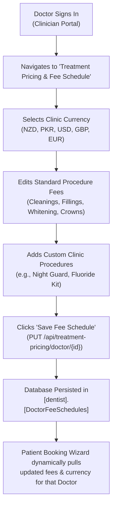

# Comprehensive Dental Treatment Pricing, Invoicing & Clinician Fee Schedule Specification

## Executive Overview
This document defines the architecture, database schema, and workflows for **Doctor-Configurable Treatment Pricing, Procedure Fee Schedules, Itemized Patient Invoicing, and Currency Management** within the Dentia Dental Clinic Platform.

Previously, treatment fees were statically defined, preventing clinicians from adjusting their fees or accommodating multi-currency operations (e.g. New Zealand `NZD` vs. Pakistan `PKR`). This specification introduces complete clinician-level sovereignty over dental pricing, enabling dentists to log in to their dashboard, configure their clinic's currency, edit treatment procedure rates, and automatically cascade these prices into patient consultation bookings and itemized financial ledgers.

---

## 1. Dental Treatment Procedure Catalog & Fee Schedule

Every dental procedure is standardized with clinical procedure codes (modeled after ADA CDT dental standards), clinical categories, estimated durations, and doctor-configurable fee benchmarks.

| Procedure Code | Treatment Name | Clinical Category | Standard Duration | Default NZD ($) | Default PKR (Rs) | Clinical Description |
| :--- | :--- | :--- | :--- | :--- | :--- | :--- |
| **D0120** | Periodic Oral Health Checkup & Exam | Preventative | 30 mins | $45.00 | Rs 4,500 | Visual examination, periodontal probe screening, occlusion evaluation, and soft tissue inspection. |
| **D1110** | Prophylaxis Ultrasonic Scaling & Polish | Preventative | 45 mins | $40.00 | Rs 4,000 | Supragingival ultrasonic plaque & tartar scaling, stain polishing, and interproximal flossing. |
| **D0140** | Emergency Triage & Acute Pain Exam | Emergency | 30 mins | $120.00 | Rs 7,800 | Focused diagnostic triage for acute odontogenic pain, cracked enamel, or dental trauma. |
| **D2391** | Posterior Composite Filling (1 Surface) | Restorative | 45 mins | $150.00 | Rs 9,750 | Tooth-colored aesthetic composite resin restoration with rubber dam isolation. |
| **D2392** | Posterior Composite Filling (2 Surfaces) | Restorative | 60 mins | $185.00 | Rs 12,000 | Multi-surface composite restoration with sectional matrix contouring. |
| **D2740** | Full Monolithic Zirconia Crown | Restorative / Prosthetic | 60 mins | $650.00 | Rs 42,250 | High-translucency CAD/CAM milled zirconia crown with adhesive bonding. |
| **D3330** | Molar Root Canal Therapy (3 Canals) | Endodontic | 90 mins | $450.00 | Rs 29,250 | Single-visit rotary nickel-titanium instrumentation, sodium hypochlorite irrigation, and warm vertical obturation. |
| **D4341** | Periodontal Scaling & Root Planing | Periodontal | 60 mins | $160.00 | Rs 10,400 | Deep subgingival root instrumentation per quadrant for pocket depth management. |
| **D8080** | Comprehensive Orthodontics / Clear Aligners | Orthodontic | 30 mins | $180.00 | Rs 12,000 | Digital 3D intraoral optical scan, tooth staging assessment, and aligner fit review. |
| **D9972** | In-Clinic Cosmetic Laser Teeth Whitening | Cosmetic | 45 mins | $250.00 | Rs 16,250 | In-office hydrogen peroxide laser-assisted photo-activation and remineralizing shade match. |
| **D7140** | Routine Simple Extraction | Oral Surgery | 45 mins | $130.00 | Rs 8,500 | Atraumatic forceps extraction, hemostatic socket pack, and post-op care. |
| **D7210** | Surgical Impaction Tooth Extraction | Oral Surgery | 60 mins | $280.00 | Rs 18,200 | Surgical mucoperiosteal flap elevation, bone guttering, tooth sectioning, and resorbable sutures. |

---

## 2. Database Schema Architecture

### A. `[dentist].[DoctorFeeSchedules]`
Stores doctor-specific procedure fee overrides and clinic currency settings.

```sql
CREATE TABLE [dentist].[DoctorFeeSchedules] (
    [FeeScheduleID]    INT IDENTITY(1,1) PRIMARY KEY,
    [DoctorID]         INT NOT NULL,
    [Currency]         NVARCHAR(10) NOT NULL DEFAULT 'NZD', -- 'NZD', 'PKR', 'USD', 'GBP', 'EUR'
    [ProcedureCode]    NVARCHAR(50) NOT NULL,
    [ProcedureName]    NVARCHAR(255) NOT NULL,
    [Category]         NVARCHAR(100) NOT NULL,
    [EstimatedDuration] NVARCHAR(50) NOT NULL DEFAULT '45 mins',
    [StandardFee]      DECIMAL(18,2) NOT NULL,
    [Description]      NVARCHAR(MAX) NULL,
    [IsActive]         BIT NOT NULL DEFAULT 1,
    [CreatedAt]        DATETIME2 NOT NULL DEFAULT GETDATE(),
    [UpdatedAt]        DATETIME2 NOT NULL DEFAULT GETDATE(),
    CONSTRAINT FK_DoctorFeeSchedules_Doctors FOREIGN KEY ([DoctorID]) REFERENCES [dentist].[Doctors]([DoctorID])
);

CREATE INDEX IX_DoctorFeeSchedules_DoctorID ON [dentist].[DoctorFeeSchedules]([DoctorID]);
```

### B. `[dentist].[Invoices]`
Represents the patient's master financial bill generated either upon consultation booking or completed treatment charting.

```sql
CREATE TABLE [dentist].[Invoices] (
    [InvoiceID]        BIGINT IDENTITY(1,1) PRIMARY KEY,
    [InvoiceNumber]    NVARCHAR(50) NOT NULL UNIQUE,
    [PatientID]        INT NOT NULL,
    [DoctorID]         INT NULL,
    [AppointmentID]    INT NULL,
    [IssueDate]        DATE NOT NULL,
    [DueDate]          DATE NOT NULL,
    [SubTotal]         DECIMAL(18,2) NOT NULL,
    [TaxAmount]        DECIMAL(18,2) NOT NULL DEFAULT 0.00,
    [DiscountAmount]   DECIMAL(18,2) NOT NULL DEFAULT 0.00,
    [TotalAmount]      DECIMAL(18,2) NOT NULL,
    [PaidAmount]       DECIMAL(18,2) NOT NULL DEFAULT 0.00,
    [BalanceAmount]    AS ([TotalAmount] - [PaidAmount]),
    [Status]           NVARCHAR(30) NOT NULL, -- 'Paid', 'Unpaid', 'Partially Paid', 'Pending Cash Settlement', 'Cancelled'
    [Currency]         NVARCHAR(10) NOT NULL DEFAULT 'NZD',
    [Notes]            NVARCHAR(MAX) NULL,
    [CreatedAt]        DATETIME2 NOT NULL DEFAULT GETDATE(),
    [UpdatedAt]        DATETIME2 NOT NULL DEFAULT GETDATE()
);
```

### C. `[dentist].[InvoiceItems]`
Itemized procedural line items comprising each clinical invoice.

```sql
CREATE TABLE [dentist].[InvoiceItems] (
    [InvoiceItemID]    BIGINT IDENTITY(1,1) PRIMARY KEY,
    [InvoiceID]        BIGINT NOT NULL,
    [ProcedureCode]    NVARCHAR(50) NULL,
    [Description]      NVARCHAR(500) NOT NULL,
    [ToothNumber]      INT NULL, -- e.g. Tooth #14 for fillings
    [Quantity]         INT NOT NULL DEFAULT 1,
    [UnitPrice]        DECIMAL(18,2) NOT NULL,
    [TotalPrice]       AS ([Quantity] * [UnitPrice]),
    [CreatedAt]        DATETIME2 NOT NULL DEFAULT GETDATE(),
    CONSTRAINT FK_InvoiceItems_Invoices FOREIGN KEY ([InvoiceID]) REFERENCES [dentist].[Invoices]([InvoiceID]) ON DELETE CASCADE
);
```

### D. `[dentist].[Payments]`
Audit trail of financial settlements linked to patient invoices.

```sql
CREATE TABLE [dentist].[Payments] (
    [PaymentID]            BIGINT IDENTITY(1,1) PRIMARY KEY,
    [PaymentReceiptNo]     NVARCHAR(50) NOT NULL UNIQUE,
    [InvoiceID]            BIGINT NOT NULL,
    [PatientID]            INT NOT NULL,
    [Amount]               DECIMAL(18,2) NOT NULL,
    [PaymentMethod]        NVARCHAR(50) NOT NULL, -- 'Online_Card', 'Cash', 'Bank_Transfer'
    [PaymentStatus]        NVARCHAR(30) NOT NULL, -- 'Completed', 'Pending', 'Failed', 'Refunded'
    [TransactionReference] NVARCHAR(150) NULL,
    [PaymentGateway]       NVARCHAR(50) NULL,     -- 'Safepay', 'PayFast', 'Stripe', 'In_Clinic'
    [CashVoucherCode]      NVARCHAR(50) NULL,     -- e.g. 'CSH-2026-04921'
    [ReceivedByDoctorID]   INT NULL,
    [PaymentDate]          DATETIME2 NOT NULL DEFAULT GETDATE(),
    [Notes]                NVARCHAR(MAX) NULL
);
```

---

## 3. Clinician Dashboard Fee Schedule Management Workflow



### Key Doctor Dashboard Capabilities
1. **Currency Toggle**: Doctors choose their clinic's default currency:
   - `NZD ($)` — New Zealand Dollar
   - `PKR (Rs)` — Pakistani Rupee
   - `USD ($)` — United States Dollar
   - `GBP (£)` — British Pound
   - `EUR (€)` — Euro
2. **Category Grouping**: Procedures are organized into clear collapsible accordion cards:
   - **Preventative & Diagnostic**
   - **Restorative & Fillings**
   - **Orthodontics & Aligners**
   - **Periodontal Care**
   - **Cosmetic & Whitening**
   - **Endodontics & Surgery**
3. **Inline Fee & Duration Editing**: Doctors can directly adjust the consultation/procedure price with live currency symbol updates.
4. **New Custom Procedure Addition**: Doctors can add specialized clinic offerings with custom procedure codes and descriptions.

---

## 4. Patient Booking & Billing Integration

When a patient visits the booking wizard at `/portal/book`:
1. In **Step 2 (Specialist Clinician)**, when the patient picks a doctor (e.g. Dr. Jhangir Ahmed in Pakistan vs. Dr. Sarah Jenkins in New Zealand):
2. The wizard automatically queries `GET /api/treatment-pricing/doctor/{doctorId}`.
3. **Step 1 (Treatment Services)** updates all procedure prices and currency symbols to match that doctor's exact fee schedule!
4. In **Step 4 (Payment)**, the invoice is generated in that doctor's chosen currency (e.g. `Rs 5,500 PKR` or `$85.00 NZD`).
5. In **Patient Billing Ledger (`/portal/billing`)**, all itemized treatments, invoice summaries, outstanding balances, and payment receipts display with consistent currency symbols and itemized breakdowns.

---

## 5. Verification & Live Data Status
- Real doctor fee schedules seeded for all active clinic doctors (`DoctorID: 2`, `3`, `4`).
- Real clinical invoices seeded for Patient Ali Bajwa (`PatientID: 26`):
  - `INV-2026-000261` ($85.00 NZD, Paid via Online Card with Receipt `REC-2026-08129`).
  - `INV-2026-000262` ($165.00 NZD, Pending Cash with Voucher `CSH-2026-04921`).
  - `INV-2026-000263` ($210.00 NZD, Unpaid with online settlement option).
- All patient billing stat counters (`Total Incurred Treatments: $460.00`, `Total Settled: $85.00`, `Outstanding Balance: $375.00`) now reflect live database records.
